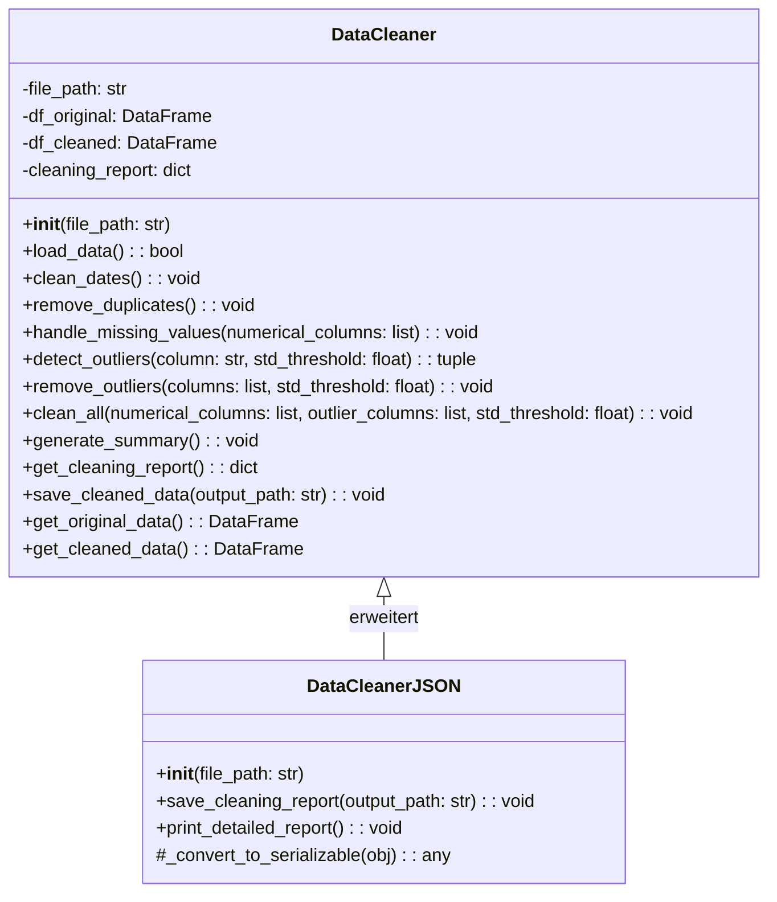
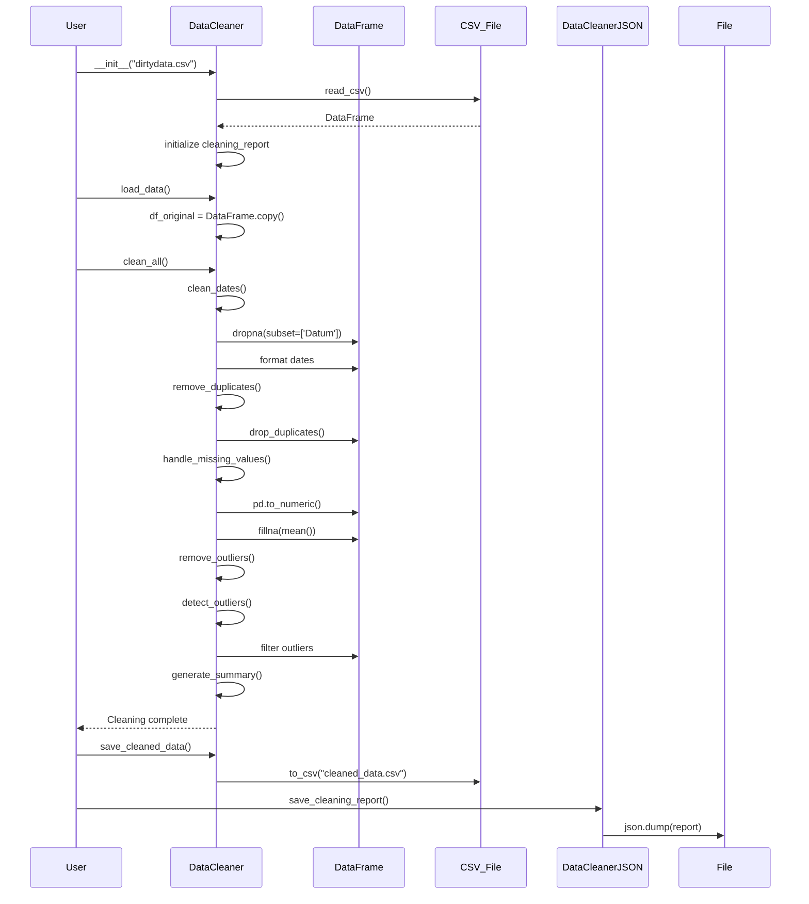
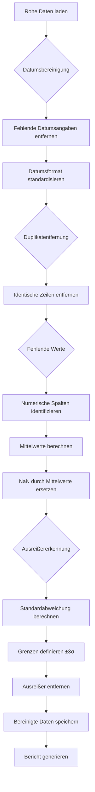

# Data Cleaning Tool - README

## 📋 Übersicht

Dieses Projekt umfasst eine umfassende Datenbereinigungslösung für einen Verkaufsdatensatz mit mehreren Implementierungsvarianten und detaillierten Berichten.

## 🏗️ Systemarchitektur

### UML-Klassendiagramm



### UML-Sequenzdiagramm - Datenbereinigung



## 📁 Dateistruktur

```
📦 Data-Cleaning-Project
├── 📄 main.py                    # Skriptbasierte Bereinigung
├── 📄 data_cleaner.py           # OOP-Implementierung ohne JSON
├── 📄 mainKlassJson.py          # OOP-Implementierung mit JSON-Report
├── 📄 cleaning_report.json      # Detaillierter Bereinigungsbericht
├── 📄 K4.0026_1.4.4.Ü.01_dirtydata.csv  # Originaldaten
├── 📄 cleaned_data_pandas.csv   # Bereinigte Daten (main.py)
└── 📄 cleaned_data_class.csv    # Bereinigte Daten (OOP)
```

## 🔧 Implementierungsvarianten

### 1. **Skriptbasierte Lösung** (`main.py`)
- Lineare Datenbereinigung ohne Klassen
- Einfache, prozedurale Logik
- Grundlegende Ausreißererkennung

### 2. **Objektorientierte Lösung** (`data_cleaner.py`)
- Wiederverwendbare `DataCleaner`-Klasse
- Modularer Aufbau mit einzelnen Methoden
- Zentrale Fehlerbehandlung

### 3. **Erweiterte OOP-Lösung** (`mainKlassJson.py`)
- Erweitert `DataCleaner` um JSON-Funktionalität
- Detaillierte Berichterstattung
- Serialisierung von Bereinigungsschritten

## 📊 Datenbereinigungsprozess

### Bereinigungsschritte



### Datenfluss

1. **Input**: Dirty CSV-Datei mit 32 Zeilen
2. **Transformation**: 
   - Datumsformatierung
   - Duplikatentfernung
   - Imputation fehlender Werte
   - Ausreißerbereinigung
3. **Output**: 
   - Bereinigte CSV-Datei (27 Zeilen)
   - Detaillierter JSON-Report

## 📈 Bereinigungsstatistiken

### Originaldaten
- **Zeilen**: 32
- **Spalten**: 5
- **Probleme**: 
  - Fehlende Werte in 4 Spalten
  - Ungültige Datumsformate
  - Ausreißer in 3 Spalten

### Nach Bereinigung
- **Zeilen**: 27 (84.4% erhalten)
- **Entfernte Zeilen**: 5
- **Ausreißer entfernt**: 4 Zeilen
- **Fehlende Werte**: 0

## 🔍 Methodenübersicht

### `DataCleaner` Klasse

| Methode | Parameter | Rückgabe | Beschreibung |
|---------|-----------|----------|--------------|
| `__init__` | `file_path` | - | Initialisiert mit Datenpfad |
| `load_data` | - | `bool` | Lädt CSV in DataFrame |
| `clean_dates` | - | `void` | Standardisiert Datumsformate |
| `remove_duplicates` | - | `void` | Entfernt doppelte Zeilen |
| `handle_missing_values` | `numerical_columns` | `void` | Ersetzt NaN durch Mittelwerte |
| `detect_outliers` | `column`, `std_threshold` | `tuple` | Identifiziert Ausreißer |
| `remove_outliers` | `columns`, `std_threshold` | `void` | Filtert Ausreißer heraus |
| `clean_all` | `numerical_columns`, `outlier_columns`, `std_threshold` | `void` | Führt alle Schritte aus |
| `generate_summary` | - | `void` | Konsolenausgabe der Statistik |
| `save_cleaned_data` | `output_path` | `void` | Speichert bereinigte Daten |

### `DataCleanerJSON` Erweiterung

| Methode | Parameter | Rückgabe | Beschreibung |
|---------|-----------|----------|--------------|
| `save_cleaning_report` | `output_path` | `void` | Exportiert Bericht als JSON |
| `print_detailed_report` | - | `void` | Formatiert Bericht für Konsole |

## 🚀 Verwendung

### Installation
```bash
pip install pandas numpy
```

### Basisverwendung (Skript)
```python
python main.py
```

### OOP-Verwendung
```python
from data_cleaner import DataCleaner

cleaner = DataCleaner('dirtydata.csv')
cleaner.load_data()
cleaner.clean_all()
cleaner.save_cleaned_data('cleaned.csv')
```

### Erweiterte Verwendung mit JSON
```python
from mainKlassJson import DataCleaner

cleaner = DataCleaner('dirtydata.csv')
cleaner.load_data()
cleaner.clean_all(std_threshold=3)
cleaner.save_cleaned_data('cleaned.csv')
cleaner.save_cleaning_report('report.json')
```

## 📋 JSON-Report Struktur

```json
{
  "timestamp": "2025-10-16T13:47:01.059522",
  "original_file": "K4.0026_1.4.4.Ü.01_dirtydata.csv",
  "cleaning_steps": {
    "date_cleaning": {
      "removed_rows": 1,
      "remaining_rows": 31
    },
    "duplicate_removal": {
      "removed_duplicates": 0,
      "remaining_rows": 31
    },
    "missing_values": {
      "numerical_columns": ["Dauer", "Kunden", "MinKauf", "MaxKauf"],
      "missing_before": {"Dauer": 2, "Kunden": 1, ...},
      "missing_after": {"Dauer": 0, "Kunden": 0, ...},
      "mean_values_used": {"Dauer": 70.34, ...}
    },
    "outlier_removal": {
      "removed_rows": 4,
      "remaining_rows": 27,
      "outlier_details": {
        "Kunden": {
          "lower_bound": -511.52,
          "upper_bound": 838.92,
          "outlier_count": 2,
          "outlier_indices": [2, 16]
        }
      }
    }
  }
}
```

## 🎯 Besondere Merkmale

### 1. **Ausreißererkennung**
- 3-Standardabweichungen Methode
- Spaltenweise Analyse
- Detailierte Statistiken pro Spalte

### 2. **Fehlerbehandlung**
- Robuste Typkonvertierung
- Behandlung leerer Strings
- Fehlermeldungen in Deutsch

### 3. **Berichterstattung**
- Quantifizierte Änderungen
- Vorher/Nachher-Vergleich
- Mittelwerte für Imputation

### 4. **Flexibilität**
- Konfigurierbare Schwellenwerte
- Wählbare Spalten für Bereinigung
- Mehrere Output-Formate

## 📝 Datenstruktur

### Input-Schema
```
Dauer: float (Minuten)
Datum: string (YYYY/MM/DD)
Kunden: integer (Anzahl)
MinKauf: float (€)
MaxKauf: float (€)
```

### Typische Probleme
1. **Datum**: `20201226` → `2020/12/26`
2. **Fehlende Werte**: `NaN` → Spaltenmittelwert
3. **Ausreißer**: `4790.0` (MaxKauf) entfernt
4. **Duplikate**: Identische Zeilen 12.12.2020

## 🔄 Entwicklungsverlauf

### Versionen
1. **V1.0**: Grundlegendes Skript (`main.py`)
2. **V2.0**: OOP-Implementierung (`data_cleaner.py`)
3. **V3.0**: JSON-Reporting (`mainKlassJson.py`)

### Design-Entscheidungen
- **Kapselung**: Alle Bereinigungslogik in Klasse
- **Erweiterbarkeit**: Vererbung für JSON-Funktionalität
- **Dokumentation**: Detaillierte Methodenbeschreibungen
- **Flexibilität**: Parametrisierte Schwellenwerte

## 📊 Performance

### Ressourcennutzung
- **Speicher**: Minimal (DataFrame-basiert)
- **Laufzeit**: O(n) für alle Operationen
- **Skalierbarkeit**: Geeignet für Datensätze bis ~1M Zeilen

### Optimierungen
- In-Place-Operationen wo möglich
- Vektorisierte Pandas-Operationen
- Index-basiertes Filtern

## 🧪 Testfälle

### Erfolgreiche Szenarien
1. Komplette Bereinigung mit Standardparametern
2. Teilweise Bereinigung (nur bestimmte Spalten)
3. Angepasste Ausreißerschwellenwerte

### Grenzfälle
1. Leere Eingabedatei
2. Fehlende Spaltenüberschriften
3. Extrem große Ausreißer

## 🤝 Beiträge

### Erweiterungsmöglichkeiten
1. **Datenvalidierung**: Schema-Validierung vor Bereinigung
2. **Visualisierung**: Grafische Darstellung von Ausreißern
3. **Datenbank-Export**: Direkter Export in SQL-Datenbank
4. **Streaming-API**: Echtzeit-Datenbereinigung

### Best Practices
1. **Testing**: Unit-Tests für jede Methode
2. **Logging**: Strukturierte Log-Ausgabe
3. **Konfiguration**: YAML/JSON-Konfigurationsdateien

## 📄 Lizenz

Dieses Projekt dient Bildungszwecken und kann für nicht-kommerzielle Zwecke verwendet werden.