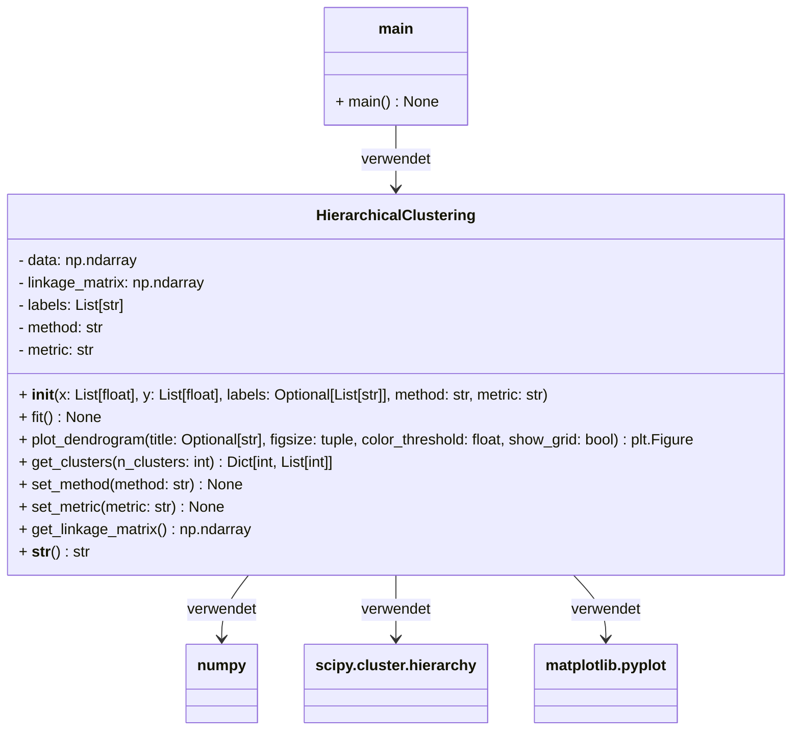
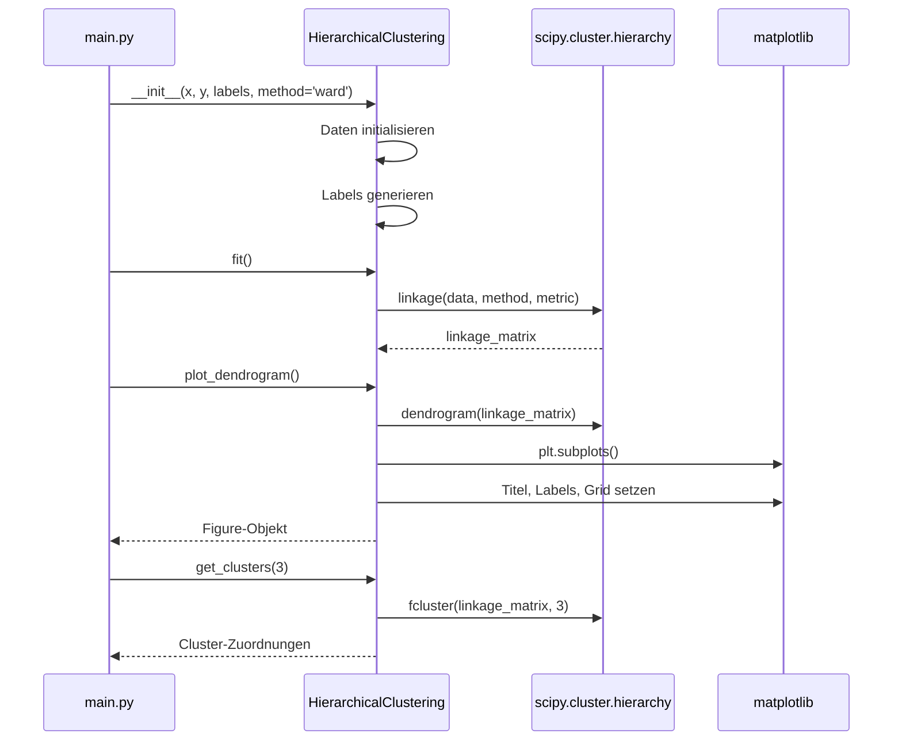
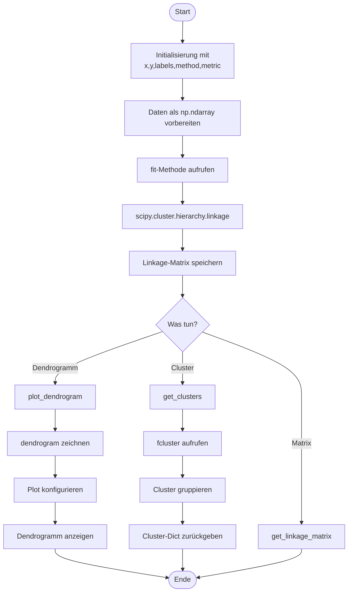

# Hierarchical Clustering Projekt

## 📋 Projektübersicht

Dieses Projekt implementiert eine Python-Klasse für hierarchisches Clustering mit Dendrogramm-Visualisierung. Es bietet eine benutzerfreundliche Schnittstelle zur Durchführung von Cluster-Analysen auf zweidimensionalen Daten und ermöglicht die Visualisierung der Ergebnisse in Form von Dendrogrammen.

## 🏗️ UML-Diagramm

### Klassendiagramm



### Sequenzdiagramm: Grundlegende Nutzung



### Aktivitätsdiagramm: Cluster-Analyse Workflow



## 📁 Dateistruktur

```
hierarchical_clustering/
├── hierarchical_clustering.py  # Hauptklasse
├── main.py                     # Demo-Skript
└── README.md                   # Diese Dokumentation
```

## 🚀 Installation und Abhängigkeiten

### Voraussetzungen
- Python 3.7 oder höher
- pip (Python Package Manager)

### Installation der Abhängigkeiten

```bash
pip install numpy matplotlib scipy
```

### Alternative: requirements.txt
```
numpy>=1.21.0
matplotlib>=3.5.0
scipy>=1.7.0
```

Installieren mit:
```bash
pip install -r requirements.txt
```

## 📊 Funktionsweise

### 1. Datenstruktur
- Die Klasse arbeitet mit 2D-Datenpunkten (x, y Koordinaten)
- Daten werden als `numpy.ndarray` gespeichert
- Jeder Punkt kann ein Label haben (automatisch generiert oder benutzerdefiniert)

### 2. Linkage-Methoden
Die Klasse unterstützt verschiedene Linkage-Methoden:
- **ward**: Minimiert die Varianz innerhalb der Cluster
- **complete**: Maximale Distanz zwischen Clustern
- **average**: Durchschnittliche Distanz zwischen Clustern
- **single**: Minimale Distanz zwischen Clustern
- **weighted**, **centroid**, **median**: Zusätzliche Optionen

### 3. Distanzmetriken
Verfügbare Distanzmetriken:
- **euclidean**: Euklidische Distanz (Standard)
- **cityblock**: Manhattan-Distanz
- **cosine**: Kosinus-Distanz
- **correlation**: Korrelations-Distanz

## 💻 Verwendung

### Grundlegende Verwendung

```python
from hierarchical_clustering import HierarchicalClustering

# Daten vorbereiten
x = [4, 6, 9, 4, 3, 11, 12, 6, 10, 12]
y = [22, 18, 25, 16, 16, 24, 24, 22, 21, 21]

# Clustering initialisieren
hc = HierarchicalClustering(x, y, method='ward')

# Clusterbildung durchführen
hc.fit()

# Dendrogramm anzeigen
fig = hc.plot_dendrogram(title="Mein Clustering")

# Cluster-Zuordnungen erhalten
clusters = hc.get_clusters(3)
print(clusters)
```

### Erweiterte Funktionen

```python
# Benutzerdefinierte Labels
custom_labels = ['A', 'B', 'C', 'D', 'E']
hc = HierarchicalClustering(x[:5], y[:5], labels=custom_labels)

# Methode ändern
hc.set_method('complete')
hc.set_metric('cityblock')

# Linkage-Matrix abrufen
linkage_matrix = hc.get_linkage_matrix()

# Verschiedene Cluster-Anzahlen testen
for n in [2, 3, 4, 5]:
    clusters = hc.get_clusters(n)
    print(f"{n} Cluster: {clusters}")
```

## 📈 Beispielausgabe

### Konsolenausgabe (Auszug)
```
=== Hierarchical Clustering Demo ===

Datenpunkte: 10 Punkte
P1: (4, 22)
P2: (6, 18)
...

1. Grundlegendes Clustering mit Ward-Methode
Cluster-Zuordnungen (3 Cluster):
Cluster 1: [0, 1, 7] -> ['P1(4,22)', 'P2(6,18)', 'P8(6,22)']
Cluster 2: [2, 5, 6] -> ['P3(9,25)', 'P6(11,24)', 'P7(12,24)']
Cluster 3: [3, 4, 8, 9] -> ['P4(4,16)', 'P5(3,16)', 'P9(10,21)', 'P10(12,21)']
```

### Visualisierungen
Das Programm erstellt mehrere Dendrogramme:
1. Grundlegendes Dendrogramm mit Ward-Methode
2. Dendrogramm mit benutzerdefinierten Labels
3. Vergleich verschiedener Linkage-Methoden

## 🔧 Methoden-Referenz

### `__init__(x, y, labels=None, method='ward', metric='euclidean')`
Initialisiert das Clustering-Objekt.

**Parameter:**
- `x`: Liste der x-Koordinaten
- `y`: Liste der y-Koordinaten
- `labels`: Optionale Beschriftungen für Datenpunkte
- `method`: Linkage-Methode (default: 'ward')
- `metric`: Distanzmetrik (default: 'euclidean')

### `fit()`
Führt die hierarchische Clusterbildung durch und berechnet die Linkage-Matrix.

### `plot_dendrogram(title=None, figsize=(10,6), color_threshold=0, show_grid=True)`
Erstellt und zeigt ein Dendrogramm.

**Parameter:**
- `title`: Titel des Dendrogramms
- `figsize`: Größe der Figur
- `color_threshold`: Schwellenwert für Cluster-Farben
- `show_grid`: Gitterlinien anzeigen

**Rückgabe:** `matplotlib.figure.Figure` Objekt

### `get_clusters(n_clusters)`
Gibt Cluster-Zuordnungen für eine bestimmte Anzahl von Clustern zurück.

**Parameter:** `n_clusters` - Anzahl der gewünschten Cluster

**Rückgabe:** Dictionary mit Cluster-ID als Key und Listen von Punkt-Indizes als Value

### `set_method(method)`
Ändert die Linkage-Methode.

### `set_metric(metric)`
Ändert die Distanzmetrik.

### `get_linkage_matrix()`
Gibt die berechnete Linkage-Matrix zurück.

### `__str__()`
Gibt eine String-Repräsentation des Objekts zurück.

## 🧪 Tests und Validierung

Das `main.py` Skript demonstriert verschiedene Anwendungsfälle:

1. **Grundlegendes Clustering**: Standard-Ward-Methode mit automatischen Labels
2. **Benutzerdefinierte Labels**: Verwendung von eigenen Punkt-Beschriftungen
3. **Methodenvergleich**: Vergleich von Ward, Complete und Average Linkage
4. **Cluster-Analyse**: Untersuchung mit verschiedenen Cluster-Anzahlen (2, 3, 4)

## ⚠️ Fehlerbehandlung

Die Klasse enthält umfassende Fehlerbehandlung:
- Validierung der Eingabelängen
- Prüfung auf gültige Methoden und Metriken
- Exception-Handling bei Berechnungsfehlern
- Warnungen bei potenziell problematischen Metrik-Kombinationen

## 🔍 Anwendungsfälle

Diese Implementierung eignet sich für:
- Datenexploration und -visualisierung
- Cluster-Analyse von 2D-Daten
- Vergleich verschiedener Clustering-Methoden
- Lehre und Forschung im Bereich maschinelles Lernen
- Vorverarbeitung für andere Analyse-Methoden

## 📚 Weiterführende Informationen

### Theoretischer Hintergrund
- **Hierarchisches Clustering**: Agglomerative Methode (bottom-up)
- **Dendrogramm**: Baumdiagramm zur Visualisierung der Cluster-Hierarchie
- **Linkage-Matrix**: Enthält Informationen über Cluster-Zusammenführungen

### Nützliche Ressourcen
- SciPy Dokumentation: `scipy.cluster.hierarchy`
- Matplotlib Dokumentation für Diagrammanpassung
- Grundlagen des maschinellen Lernens: Clustering-Algorithmen

## 🤝 Beitrag

Beiträge sind willkommen! Bitte:
1. Forken Sie das Repository
2. Erstellen Sie einen Feature-Branch
3. Committen Sie Ihre Änderungen
4. Pushen Sie zum Branch
5. Erstellen Sie einen Pull Request

## 📄 Lizenz

Dieses Projekt steht unter der MIT-Lizenz. Siehe LICENSE Datei für Details.

## ✍️ Autor

HierarchicalClustering Klasse für Python

---

*Letztes Update: November 2023*