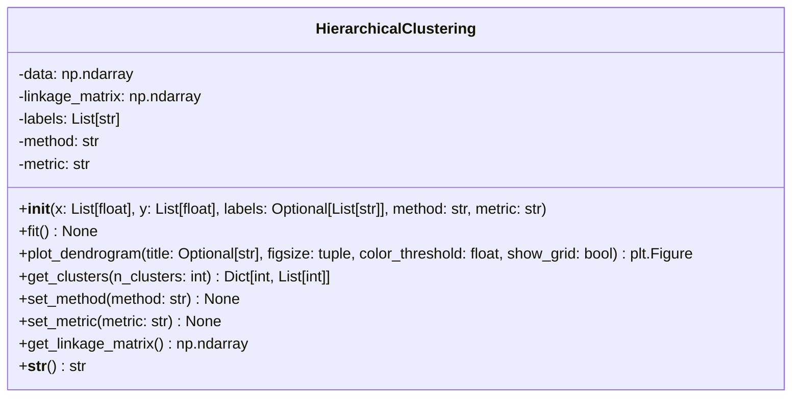

# Hierarchical Clustering Projekt

Eine Python-Implementierung für hierarchisches Clustering mit Dendrogramm-Visualisierung und verschiedenen Linkage-Methoden.

## Projektstruktur

```
hierarchical_clustering/
├── hierarchical_clustering.py  # Hauptklasse für hierarchisches Clustering
├── main.py                     # Demonstrationsskript
└── README.md                   # Diese Datei
```

## UML-Klassendiagramm

### Detailierte UML für `HierarchicalClustering` Klasse



### Methoden-Details

#### Konstruktor: `__init__(x, y, labels, method, metric)`
- **Parameter**:
  - `x: List[float]` - x-Koordinaten der Datenpunkte
  - `y: List[float]` - y-Koordinaten der Datenpunkte
  - `labels: Optional[List[str]]` - Beschriftungen für die Datenpunkte (optional)
  - `method: str` - Linkage-Methode ('ward', 'complete', 'average', 'single')
  - `metric: str` - Distanzmetrik ('euclidean', 'cityblock', 'cosine', etc.)

- **Funktionalität**:
  - Kombiniert x- und y-Koordinaten zu einem 2D-Array
  - Generiert automatische Labels falls keine bereitgestellt werden
  - Validiert die Länge der Labels

#### `fit()`
- **Funktionalität**: Führt die hierarchische Clusterbildung durch
- **Exception**: `ValueError` bei Fehlern in der Clusterbildung
- **Seiteneffekt**: Setzt `self.linkage_matrix`

#### `plot_dendrogram(title, figsize, color_threshold, show_grid)`
- **Parameter**:
  - `title: Optional[str]` - Titel des Dendrogramms
  - `figsize: tuple` - Größe der Figur (Standard: (10, 6))
  - `color_threshold: float` - Schwellenwert für Cluster-Farben
  - `show_grid: bool` - Zeigt Gitterlinien an
  
- **Rückgabe**: `plt.Figure` - Matplotlib Figure-Objekt
- **Funktionalität**: Erstellt und konfiguriert das Dendrogramm

#### `get_clusters(n_clusters)`
- **Parameter**: `n_clusters: int` - Anzahl der gewünschten Cluster
- **Rückgabe**: `Dict[int, List[int]]` - Cluster-Zuordnungen
- **Funktionalität**: Gruppiert Datenpunkte in die angegebene Anzahl von Clustern

#### `set_method(method)`
- **Parameter**: `method: str` - Neue Linkage-Methode
- **Validierung**: Prüft gegen gültige Methoden
- **Seiteneffekt**: Setzt `linkage_matrix` zurück für neues Fitting

#### `set_metric(metric)`
- **Parameter**: `metric: str` - Neue Distanzmetrik
- **Warnung**: Gibt Warnung bei potenziell problematischen Metriken
- **Seiteneffekt**: Setzt `linkage_matrix` zurück für neues Fitting

#### `get_linkage_matrix()`
- **Rückgabe**: `np.ndarray` - Kopie der Linkage-Matrix
- **Funktionalität**: Gibt die berechnete Linkage-Matrix zurück

#### `__str__()`
- **Rückgabe**: `str` - String-Repräsentation der Klasse

## Verwendung

### Grundlegende Verwendung

```python
from hierarchical_clustering import HierarchicalClustering

# Daten definieren
x = [4, 6, 9, 4, 3, 11, 12, 6, 10, 12]
y = [22, 18, 25, 16, 16, 24, 24, 22, 21, 21]

# Clustering durchführen
hc = HierarchicalClustering(x, y, method='ward')
hc.plot_dendrogram()
plt.show()

# Cluster-Zuordnungen erhalten
clusters = hc.get_clusters(3)
```

### Demo ausführen

```bash
python main.py
```

Die Demo zeigt:
1. Grundlegendes Clustering mit Ward-Methode
2. Clustering mit benutzerdefinierten Labels
3. Vergleich verschiedener Linkage-Methoden
4. Cluster-Analyse mit verschiedenen Anzahlen

## Abhängigkeiten

- `numpy` >= 1.20.0
- `matplotlib` >= 3.3.0
- `scipy` >= 1.6.0

Installieren mit:
```bash
pip install numpy matplotlib scipy
```

## Supported Linkage-Methoden

- `ward` - Ward's Methode (Varianz-minimierend)
- `complete` - Complete Linkage (Maximums-Distanz)
- `average` - Average Linkage (Durchschnitts-Distanz)
- `single` - Single Linkage (Minimums-Distanz)
- `weighted` - Gewichtete Methode
- `centroid` - Zentroid-Methode
- `median` - Median-Methode

## Supported Distanzmetriken

- `euclidean` - Euklidische Distanz
- `cityblock` - Manhattan-Distanz
- `cosine` - Kosinus-Distanz
- `correlation` - Korrelations-Distanz

## Beispielausgabe

Die Demo generiert verschiedene Dendrogramme und Textausgaben:

```
=== Hierarchical Clustering Demo ===

Datenpunkte: 10 Punkte
P1: (4, 22)
P2: (6, 18)
...

Cluster-Zuordnungen (3 Cluster):
Cluster 1: [0, 1, 3, 4, 7] -> ['P1(4,22)', 'P2(6,18)', 'P4(4,16)', 'P5(3,16)', 'P8(6,22)']
Cluster 2: [2, 5, 6, 9] -> ['P3(9,25)', 'P6(11,24)', 'P7(12,24)', 'P10(12,21)']
Cluster 3: [8] -> ['P9(10,21)']
```

## Lizenz

Dieses Projekt steht unter der MIT Lizenz.