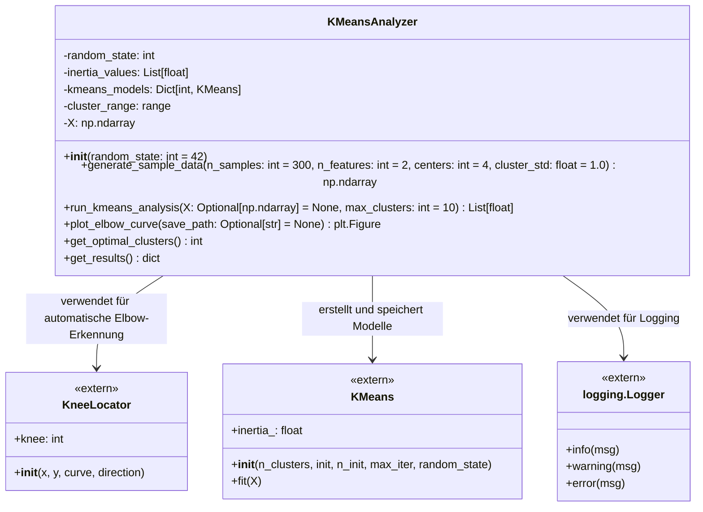
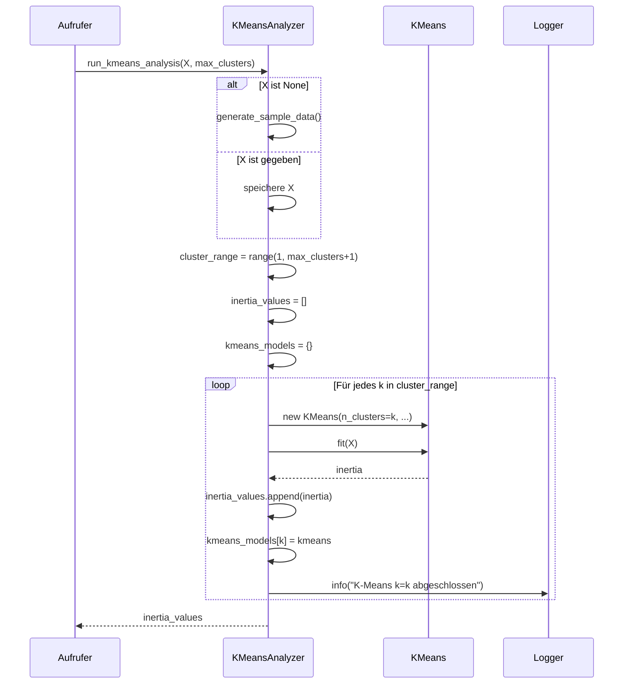
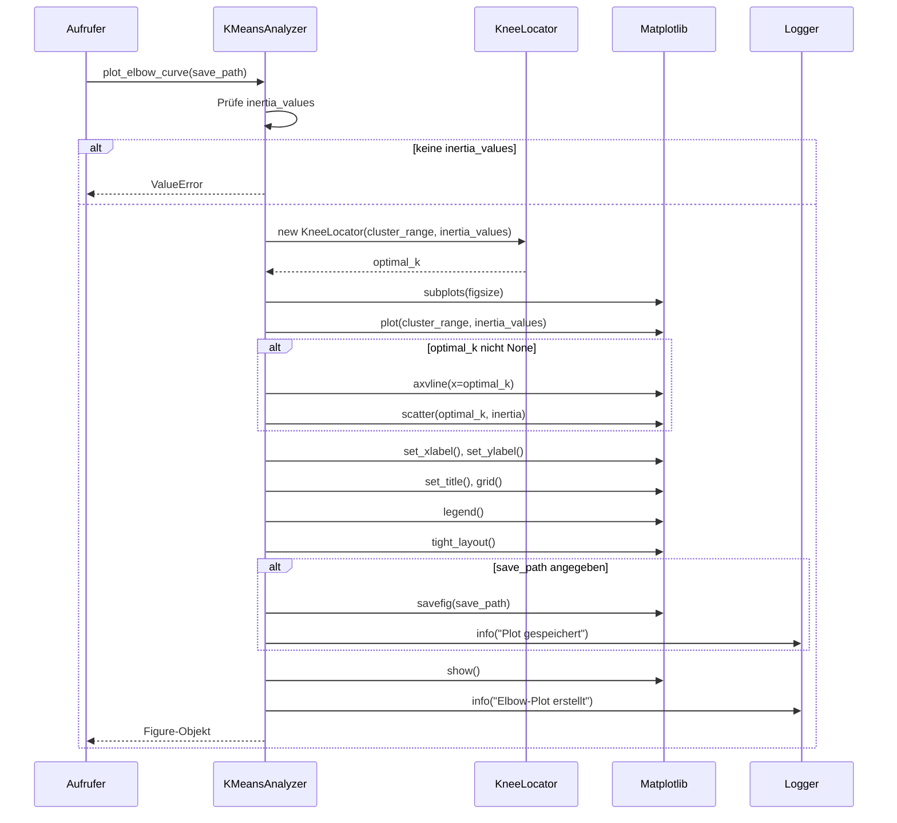
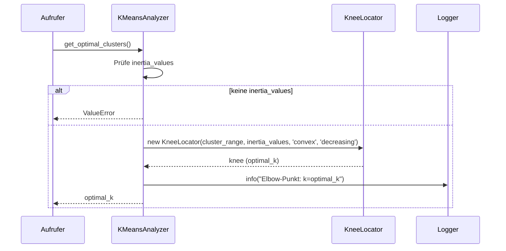

# KMeansAnalyzer - README (mit UML und Sequenzdiagramm)

## 📋 Projektübersicht

Das Projekt implementiert eine **KMeansAnalyzer-Klasse**, die den K-Means-Clustering-Algorithmus analysiert und automatisch die optimale Anzahl von Clustern bestimmt. Es verwendet die **Elbow-Methode** mit automatischer Erkennung des Knickpunkts (Knee-Punkt) mithilfe der `kneed`-Bibliothek.

## 🚀 Hauptfunktionen

- Generierung synthetischer Beispieldaten für Clustering-Analysen
- Durchführung von K-Means-Clustering mit verschiedenen Cluster-Anzahlen
- Automatische Bestimmung der optimalen Cluster-Anzahl mit KneeLocator
- Visualisierung der Ergebnisse mittels Elbow-Plot
- Umfangreiche Logging-Funktionalität
- Wiederverwendbare und modular aufgebaute Klasse

## 📁 Dateistruktur

```
project/
├── main.py              # Hauptskript mit KMeansAnalyzer-Klasse
├── elbow_plot.png       # Generierter Plot (nach Ausführung)
└── README.md            # Diese Datei
```

## 🛠️ Installation der Abhängigkeiten

```bash
pip install numpy matplotlib scikit-learn kneed
```

## 📊 UML-Klassendiagramm



## 🔄 Sequenzdiagramme

### 1. Hauptablauf der Analyse

```mermaid
sequenceDiagram
    participant User
    participant main() as Hauptprogramm
    participant KMA as KMeansAnalyzer
    participant make_blobs as Daten-Generator
    participant KMeans as K-Means-Algorithmus
    participant KneeLocator
    participant plt as Matplotlib

    User->>main(): Skript ausführen
    main()->>KMA: KMeansAnalyzer(random_state=42)
    KMA-->>main(): Analyzer-Instanz
    
    main()->>KMA: generate_sample_data()
    KMA->>make_blobs: generate_data()
    make_blobs-->>KMA: X (Daten)
    KMA-->>main(): X
    
    main()->>KMA: run_kmeans_analysis(X)
    loop Für k=1 bis max_clusters
        KMA->>KMeans: KMeans(n_clusters=k)
        KMA->>KMeans: fit(X)
        KMeans-->>KMA: inertia
        KMA->>KMA: speichere Modell und Inertia
    end
    KMA-->>main(): inertia_values
    
    main()->>KMA: get_results()
    KMA->>KMA: get_optimal_clusters()
    KMA->>KneeLocator: KneeLocator(x, y, curve, direction)
    KneeLocator-->>KMA: optimal_k
    KMA-->>main(): results
    
    main()->>KMA: plot_elbow_curve()
    KMA->>KneeLocator: finde Knee-Punkt
    KneeLocator-->>KMA: optimal_k
    KMA->>plt: Erstelle Plot
    KMA->>plt: Zeichne Elbow-Kurve
    KMA->>plt: Markiere Knee-Punkt
    KMA->>plt: Speichere Plot (optional)
    plt-->>main(): Figure-Objekt
```

### 2. Detaillierte `run_kmeans_analysis()` Methode



### 3. `plot_elbow_curve()` Methode



### 4. `get_optimal_clusters()` Methode



## 🔧 Detaillierte Klassenbeschreibung

### KMeansAnalyzer Klasse

#### Attribute
- **`random_state`** (int): Seed für reproduzierbare Ergebnisse
- **`inertia_values`** (List[float]): Liste der Inertia-Werte für jede Cluster-Anzahl
- **`kmeans_models`** (Dict[int, KMeans]): Gespeicherte K-Means-Modelle für jede Cluster-Anzahl
- **`cluster_range`** (range): Bereich der untersuchten Cluster-Anzahlen
- **`X`** (np.ndarray): Die analysierten Daten

#### Methoden

##### `__init__(random_state: int = 42)`
- Initialisiert den KMeansAnalyzer mit einem optionalen Random State
- Setzt die Startwerte für alle Attribute
- Konfiguriert das Logging

##### `generate_sample_data(n_samples=300, n_features=2, centers=4, cluster_std=1.0)`
- Generiert synthetische Beispieldaten mit `make_blobs` von scikit-learn
- Parameter:
  - `n_samples`: Anzahl der Datenpunkte
  - `n_features`: Anzahl der Merkmale (Features)
  - `centers`: Echte Anzahl der Cluster in den Daten
  - `cluster_std`: Standardabweichung der Cluster
- Rückgabe: np.ndarray mit den generierten Daten

##### `run_kmeans_analysis(X=None, max_clusters=10)`
- Führt K-Means-Clustering für verschiedene Cluster-Anzahlen durch
- Parameter:
  - `X`: Optionales Daten-Array (wenn None, werden Beispieldaten generiert)
  - `max_clusters`: Maximale Anzahl zu testender Cluster
- Rückgabe: Liste der Inertia-Werte für jede Cluster-Anzahl

##### `plot_elbow_curve(save_path=None)`
- Erstellt einen Elbow-Plot der Inertia-Werte
- Markiert automatisch den optimalen Knickpunkt (Knee)
- Parameter:
  - `save_path`: Optionaler Pfad zum Speichern des Plots
- Rückgabe: matplotlib Figure-Objekt

##### `get_optimal_clusters()`
- Bestimmt automatisch die optimale Cluster-Anzahl mit KneeLocator
- Rückgabe: int (optimale Cluster-Anzahl)

##### `get_results()`
- Gibt alle Analyseergebnisse als Dictionary zurück
- Enthält: Cluster-Bereich, Inertia-Werte, optimale Cluster-Anzahl

## 📈 Beispielverwendung

```python
# 1. Analyzer-Instanz erstellen
analyzer = KMeansAnalyzer(random_state=42)

# 2. Beispieldaten generieren
X = analyzer.generate_sample_data(n_samples=300, centers=4, cluster_std=0.8)

# 3. K-Means Analyse durchführen
inertia_values = analyzer.run_kmeans_analysis(X=X, max_clusters=10)

# 4. Ergebnisse erhalten
results = analyzer.get_results()
print(f"Optimale Cluster-Anzahl: {results['optimal_k']}")

# 5. Elbow-Plot anzeigen
analyzer.plot_elbow_curve(save_path='elbow_plot.png')
```

## 🎯 Hauptfunktion (`main()`)

Die Datei enthält eine vordefinierte Hauptfunktion, die:
1. Eine KMeansAnalyzer-Instanz erstellt
2. Beispieldaten generiert
3. Die K-Means-Analyse für 1-10 Cluster durchführt
4. Die Ergebnisse in der Konsole ausgibt
5. Einen Elbow-Plot erstellt und speichert

## 🔍 Algorithmus-Erklärung

### Elbow-Methode
Die Elbow-Methode (Knickpunkt-Methode) ist ein heuristischer Ansatz zur Bestimmung der optimalen Cluster-Anzahl. Sie basiert auf dem Prinzip, dass mit zunehmender Cluster-Anzahl die Inertia (Within-Cluster Sum of Squares) abnimmt. Der optimale Wert ist der Punkt, an dem die Abnahme der Inertia deutlich nachlässt - der "Knick" in der Kurve.

### Automatische Erkennung mit KneeLocator
Das Projekt verwendet die `kneed`-Bibliothek, um den Knickpunkt automatisch zu erkennen. Der `KneeLocator` findet den Punkt maximaler Krümmung in der Inertia-Kurve, was dem optimalen Kompromiss zwischen Modellkomplexität und Erklärungskraft entspricht.

## 📊 Ausgabe-Format

Die Ausgabe umfasst:
- Inertia-Werte für jede Cluster-Anzahl (k=1 bis k=max_clusters)
- Geschätzte optimale Cluster-Anzahl
- Visualisierung als Elbow-Plot mit markiertem Optimalpunkt

## ⚙️ Konfiguration

- **Random State**: Standardmäßig 42 für reproduzierbare Ergebnisse
- **Cluster-Bereich**: Standardmäßig 1-10 Cluster
- **Datenparameter**: Anpassbar über Methodenparameter
- **Logging-Level**: INFO (kann in `logging.basicConfig` angepasst werden)

## 📝 Bemerkungen

- Der alte manuelle Code für die Elbow-Erkennung ist auskommentiert, aber für Referenzzwecke erhalten
- Das Projekt ist als wiederverwendbare Klasse konzipiert und kann einfach in andere Projekte integriert werden
- Die automatische Erkennung ist robuster als manuelle Heuristiken

## 🐛 Fehlerbehandlung

Die Klasse enthält umfangreiche Fehlerprüfungen:
- Prüfung auf vorhandene Inertia-Werte vor der Analyse
- Validierung der Eingabeparameter
- Ausführliches Logging für Debugging-Zwecke

## 📄 Lizenz

Dieses Projekt dient Demonstrationszwecken und kann frei verwendet werden.