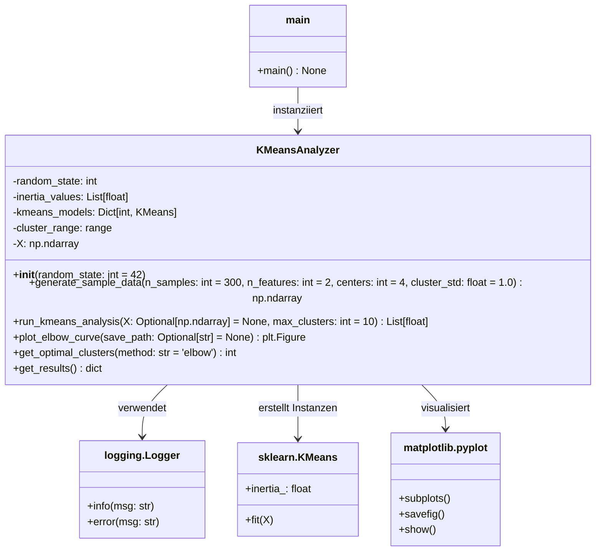
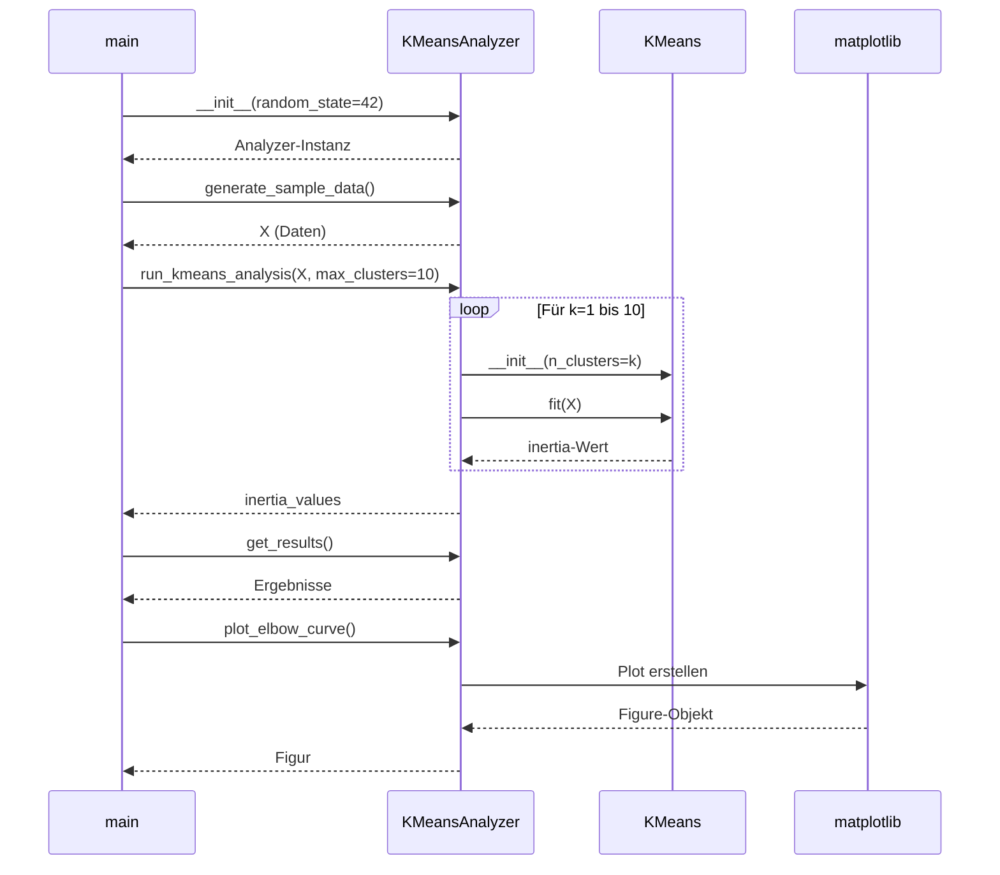

# KMeansAnalyzer Projekt

## 📋 Projektübersicht

Das `KMeansAnalyzer`-Projekt ist eine Python-basierte Implementierung zur Analyse des K-Means-Clustering-Algorithmus. Die Hauptfunktionalität umfasst die automatische Durchführung von K-Means für verschiedene Cluster-Anzahlen, die Erstellung eines Elbow-Plots zur Visualisierung und die Bestimmung der optimalen Cluster-Anzahl.

## 🏗️ Systemarchitektur

### UML-Klassendiagramm



## 📊 Sequenzdiagramm - Hauptablauf



## 📁 Projektstruktur

```
kmeans-analyzer/
├── main.py                 # Hauptskript mit KMeansAnalyzer-Klasse
├── README.md               # Diese Dokumentation
├── requirements.txt        # Abhängigkeiten
├── elbow_plot.png         # Generierter Elbow-Plot (nach Ausführung)
└── logs/                  # Log-Dateien (optional)
```

## 🔧 Abhängigkeiten

```txt
numpy>=1.21.0
matplotlib>=3.5.0
scikit-learn>=1.0.0
```

## 🚀 Installation und Verwendung

### 1. Installation der Abhängigkeiten

```bash
pip install numpy matplotlib scikit-learn
```

### 2. Ausführung des Hauptskripts

```bash
python main.py
```

### 3. Individuelle Verwendung

```python
from main import KMeansAnalyzer

# Analyzer initialisieren
analyzer = KMeansAnalyzer(random_state=42)

# Eigene Daten verwenden oder generieren
# X = analyzer.generate_sample_data(n_samples=500, centers=5)
# Oder: X = np.array([[1,2], [3,4], ...])

# Analyse durchführen
inertia_values = analyzer.run_kmeans_analysis(X=X, max_clusters=10)

# Ergebnisse anzeigen
results = analyzer.get_results()
print(f"Optimale Cluster: {results['optimal_k']}")

# Plot erstellen
analyzer.plot_elbow_curve(save_path='mein_plot.png')
```

## 📈 Methodenübersicht

### KMeansAnalyzer Klasse

| Methode | Parameter | Rückgabewert | Beschreibung |
|---------|-----------|--------------|--------------|
| `__init__` | `random_state: int` | - | Initialisiert den Analyzer |
| `generate_sample_data` | `n_samples, n_features, centers, cluster_std` | `np.ndarray` | Generiert synthetische Testdaten |
| `run_kmeans_analysis` | `X, max_clusters` | `List[float]` | Führt K-Means für k=1..max_clusters aus |
| `plot_elbow_curve` | `save_path` | `plt.Figure` | Erstellt und speichert Elbow-Plot |
| `get_optimal_clusters` | `method` | `int` | Bestimmt optimale Cluster-Anzahl |
| `get_results` | - | `dict` | Gibt alle Ergebnisse zurück |

### Hauptfunktionen

1. **Datenvorbereitung**: Generierung synthetischer Daten mit klar definierten Clustern
2. **K-Means-Analyse**: Durchführung des Algorithmus für verschiedene Cluster-Anzahlen
3. **Inertia-Berechnung**: Messung der Cluster-Qualität (Within-Cluster Sum of Squares)
4. **Elbow-Methode**: Visuelle Identifikation des optimalen k
5. **Automatische Bestimmung**: Algorithmische Schätzung des Elbow-Points

## 📝 Logging-System

Das Projekt verwendet Pythons eingebautes Logging-System mit folgenden Levels:

- **INFO**: Allgemeine Informationen und Fortschrittsmeldungen
- **ERROR**: Fehlermeldungen bei Problemen
- Format: `YYYY-MM-DD HH:MM:SS - LEVEL - MESSAGE`

Beispiel-Log:
```
2024-01-01 12:00:00 - INFO - KMeansAnalyzer mit random_state=42 initialisiert
2024-01-01 12:00:01 - INFO - Generiere Beispieldaten: 300 Samples, 2 Features, 4 Cluster
```

## 🎯 Bestimmung der optimalen Cluster-Anzahl

### Methoden

1. **Elbow-Methode (Standard)**: 
   - Visuelle Inspektion des Knickpunkts im Plot
   - Berechnung der relativen Verbesserungen
   
2. **Zweite Ableitung**:
   - Mathematische Bestimmung des stärksten Krümmungspunkts
   - Automatische Berechnung mit `method='second_derivative'`

### Interpretation des Elbow-Plots

- **X-Achse**: Anzahl der Cluster (k)
- **Y-Achse**: Inertia (Within-Cluster Sum of Squares)
- **Optimaler Punkt**: Wo die Kurve deutlich abflacht (Elbow-Point)
- **Typisches Muster**: Steiler Abfall, dann Plateau

## 🔍 Beispielergebnisse

Für 4 echte Cluster in den Daten:
```
k=1: Inertia = 1500.45
k=2: Inertia = 800.23
k=3: Inertia = 400.12    ← Optimal (starker Abfall)
k=4: Inertia = 150.05    ← Nur geringe Verbesserung
k=5: Inertia = 148.98    
k=6: Inertia = 147.50
```

## 💡 Anwendungsfälle

1. **Datenexploration**: Verständnis der Cluster-Struktur in unbekannten Datensätzen
2. **Vorverarbeitung**: Bestimmung der optimalen Cluster-Anzahl für nachfolgende Analysen
3. **Visualisierung**: Erstellung von Elbow-Plots für Berichte und Präsentationen
4. **Benchmarking**: Vergleich verschiedener Datensätze oder Feature-Sets

## ⚙️ Konfigurationsoptionen

### KMeans-Parameter
- `n_init=10`: Mehrere Initialisierungen für robustere Ergebnisse
- `init='k-means++'`: Intelligente Startpunkt-Auswahl
- `max_iter=300`: Ausreichend Iterationen für Konvergenz
- `random_state`: Reproduzierbare Ergebnisse

### Datenparameter
- `n_samples`: Anzahl der Datenpunkte (Standard: 300)
- `n_features`: Dimensionalität (Standard: 2)
- `centers`: Wahre Cluster-Anzahl (Standard: 4)
- `cluster_std`: Streuung der Cluster (Standard: 1.0)

## 📊 Output-Beispiele

### Textausgabe
```
==================================================
K-MEANS ANALYSE ERGEBNISSE
==================================================
k=1: Inertia = 1500.45
k=2: Inertia = 800.23
...
Geschätzte optimale Cluster-Anzahl: k=4
```

### Grafische Ausgabe
- Elbow-Plot als PNG-Datei
- Interaktive Matplotlib-Anzeige
- Hochauflösende Speicherung (300 DPI)

## 🔄 Erweiterungsmöglichkeiten

1. **Weitere Metriken**: Silhouette-Score, Calinski-Harabasz-Index
2. **Alternative Algorithmen**: DBSCAN, Hierarchical Clustering
3. **Datenquellen**: CSV-Einlesen, Datenbank-Anbindung
4. **Visualisierungen**: 2D/3D-Cluster-Darstellungen
5. **Interaktive Oberfläche**: Web-Interface mit Streamlit

## 🐛 Fehlerbehandlung

- Validierung der Eingabedaten
- Fehlermeldungen bei fehlenden Inertia-Werten
- Exception-Handling für Dateioperationen
- Logging aller kritischen Operationen

## 📚 Referenzen

- Scikit-learn Dokumentation: [KMeans](https://scikit-learn.org/stable/modules/generated/sklearn.cluster.KMeans.html)
- Elbow-Methode: [Wikipedia](https://en.wikipedia.org/wiki/Elbow_method_(clustering))
- K-means++: [Arthur & Vassilvitskii (2007)](https://theory.stanford.edu/~sergei/papers/kMeansPP-soda.pdf)

---

**Hinweis**: Dieses Projekt dient als Demonstration und Lernwerkzeug. Für produktive Anwendungen sollten zusätzliche Validierungen und Tests implementiert werden.