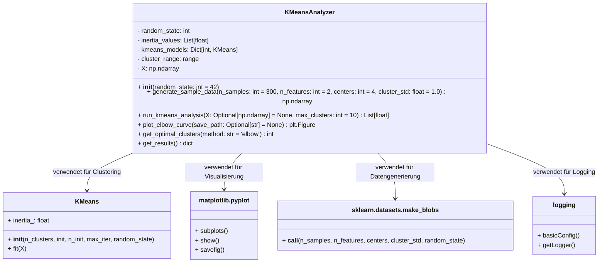
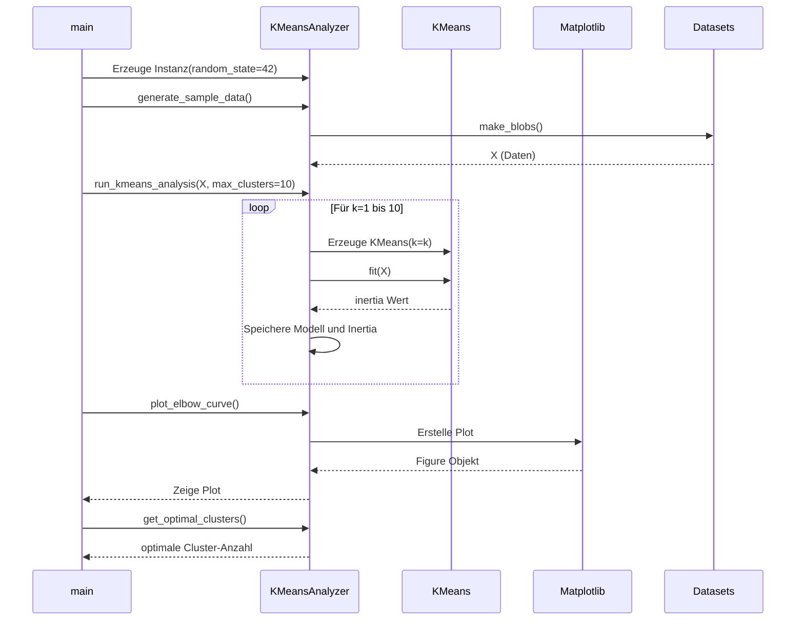

# KMeansAnalyzer - K-Means Clustering Analyse Tool

## 📋 Projektübersicht

Dieses Python-Projekt implementiert eine umfassende Lösung für die Analyse des K-Means Clustering Algorithmus. Die Hauptklasse `KMeansAnalyzer` ermöglicht die automatische Durchführung von K-Means Clustering mit verschiedenen Cluster-Anzahlen, die Visualisierung der Ergebnisse mittels Elbow-Methode und die Bestimmung der optimalen Cluster-Anzahl.

## 🏗️ Systemarchitektur

### UML-Klassendiagramm



### Sequenzdiagramm - Hauptablauf



## 📊 Funktionsweise

### 1. Datengenerierung
- Erzeugt synthetische Daten mit klar getrennten Clustern
- Verwendet `make_blobs` von scikit-learn
- Parameter: Anzahl Samples, Features, Cluster und Standardabweichung

### 2. K-Means Analyse
- Führt K-Means für verschiedene Cluster-Anzahlen durch (1 bis max_clusters)
- Speichert Inertia-Werte (Within-Cluster Sum of Squares)
- Verwendet intelligente Initialisierung (k-means++)
- Ensures Reproduzierbarkeit durch random_state

### 3. Elbow-Methode Visualisierung
- Erstellt Plot von Inertia gegen Cluster-Anzahl
- Hilft bei der Identifikation des optimalen k
- Kann Plot als Bilddatei speichern

### 4. Optimale Cluster-Bestimmung
- **Elbow-Methode**: Findet Punkt mit größtem Abknick
- **Zweite Ableitung**: Mathematischere Herangehensweise
- Gibt geschätzte optimale Cluster-Anzahl zurück

## 🛠️ Technische Details

### Abhängigkeiten
```txt
numpy >= 1.19.0
matplotlib >= 3.3.0
scikit-learn >= 0.24.0
```

### Klassendesign

#### KMeansAnalyzer Klasse
- **Zustand (Attributes)**:
  - `random_state`: Für reproduzierbare Ergebnisse
  - `inertia_values`: Gespeicherte Inertia-Werte für jedes k
  - `kmeans_models`: Dictionary der trainierten Modelle
  - `cluster_range`: Getesteter Bereich der Cluster-Anzahlen
  - `X`: Eingabedaten

- **Verhalten (Methods)**:
  - `generate_sample_data()`: Erzeugt synthetische Testdaten
  - `run_kmeans_analysis()`: Hauptanalysefunktion
  - `plot_elbow_curve()`: Visualisierung der Ergebnisse
  - `get_optimal_clusters()`: Bestimmt optimales k
  - `get_results()`: Gibt Analyseergebnisse zurück

### Algorithmus-Implementierung

#### K-Means Parameter
```python
KMeans(
    n_clusters=k,           # Anzahl der Cluster
    init='k-means++',       # Intelligente Initialisierung
    n_init=10,              # 10 verschiedene Initialisierungen
    max_iter=300,           # Maximale Iterationen
    random_state=42         # Reproduzierbarkeit
)
```

#### Inertia Berechnung
```
Inertia = Σ(d(x, centroid)²)
```
- Summe der quadrierten Abstände jedes Punktes zu seinem Cluster-Zentrum
- Niedrigere Werte bedeuten kompaktere Cluster

## 📈 Anwendungsbeispiele

### Beispiel 1: Grundlegende Verwendung
```python
# Analyzer erstellen
analyzer = KMeansAnalyzer(random_state=42)

# Daten generieren
X = analyzer.generate_sample_data(n_samples=300, centers=4)

# Analyse durchführen
inertia_values = analyzer.run_kmeans_analysis(X=X, max_clusters=10)

# Ergebnisse anzeigen
results = analyzer.get_results()
print(f"Optimale Cluster: {results['optimal_k']}")

# Visualisierung
analyzer.plot_elbow_curve()
```

### Beispiel 2: Mit eigenen Daten
```python
# Mit existierenden Daten
import pandas as pd

# Daten laden
data = pd.read_csv('meine_daten.csv')
X = data.values

# Analyse durchführen
analyzer = KMeansAnalyzer()
analyzer.run_kmeans_analysis(X=X, max_clusters=15)

# Bestes Modell extrahieren
optimal_k = analyzer.get_optimal_clusters()
best_model = analyzer.kmeans_models[optimal_k]
```

### Beispiel 3: Erweiterte Analyse
```python
# Verschiedene Methoden vergleichen
analyzer = KMeansAnalyzer()

# Daten generieren mit mehr Variabilität
X = analyzer.generate_sample_data(cluster_std=1.5)

# Analyse durchführen
analyzer.run_kmeans_analysis(max_clusters=12)

# Beide Methoden testen
k_elbow = analyzer.get_optimal_clusters(method='elbow')
k_deriv = analyzer.get_optimal_clusters(method='second_derivative')

print(f"Elbow-Methode: k={k_elbow}")
print(f"Zweite Ableitung: k={k_deriv}")
```

## 🎯 Best Practices

### 1. Datenvorbereitung
- Skalieren Sie kontinuierliche Features
- Entfernen Sie Ausreißer vor der Analyse
- Prüfen Sie auf Multikollinearität

### 2. Parameterauswahl
- `n_init=10`: Guter Kompromiss zwischen Geschwindigkeit und Qualität
- `max_iter=300`: Ausreichend für die meisten Datensätze
- `random_state`: Immer setzen für reproduzierbare Ergebnisse

### 3. Interpretation der Ergebnisse
- **Elbow-Point**: Punkt, an dem die Kurve stark abknickt
- **Inertia**: Sinkt immer mit steigendem k, aber nicht linear
- **Domain-Wissen**: Kombinieren Sie statistische mit fachlicher Analyse

## 🔍 Fehlerbehandlung

Das System implementiert umfangreiche Fehlerbehandlung:

1. **Validierung der Eingaben**: Prüft ob Daten vorhanden sind
2. **Logging**: Detaillierte Protokollierung aller Schritte
3. **Ausnahmebehandlung**: Klare Fehlermeldungen für Benutzer

```python
try:
    analyzer.plot_elbow_curve()
except ValueError as e:
    print(f"Fehler: {e}. Führen Sie zuerst run_kmeans_analysis() aus.")
```

## 📁 Projektstruktur

```
project/
│
├── main.py              # Hauptskript mit KMeansAnalyzer Klasse
├── README.md            # Diese Dokumentation
├── requirements.txt     # Python Abhängigkeiten
├── elbow_plot.png       # Beispiel-Plot (wird generiert)
└── data/                # Optional: Für eigene Datensätze
```

## 🚀 Installation und Ausführung

### Installation
```bash
pip install numpy matplotlib scikit-learn
```

### Ausführung
```bash
python main.py
```

## 📝 Lizenz und Beitrag

Dieses Projekt kann frei verwendet und modifiziert werden. Für Verbesserungsvorschläge oder Bug-Reports erstellen Sie bitte ein Issue oder einen Pull Request.

---

**Hinweis**: Die Elbow-Methode ist ein heuristischer Ansatz. Die optimale Cluster-Anzahl sollte immer im fachlichen Kontext interpretiert werden.