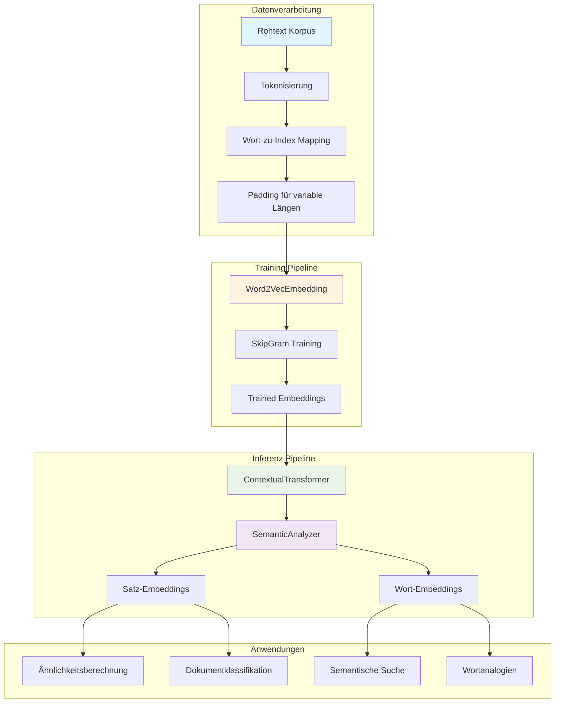
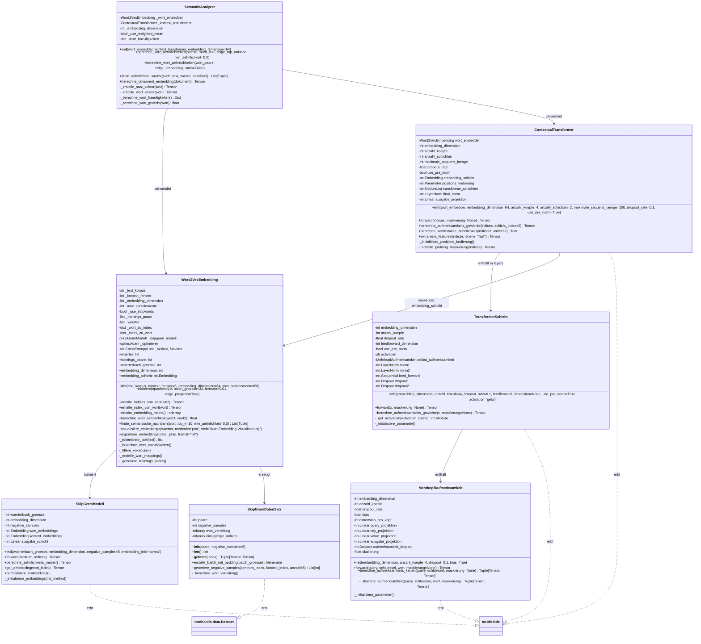
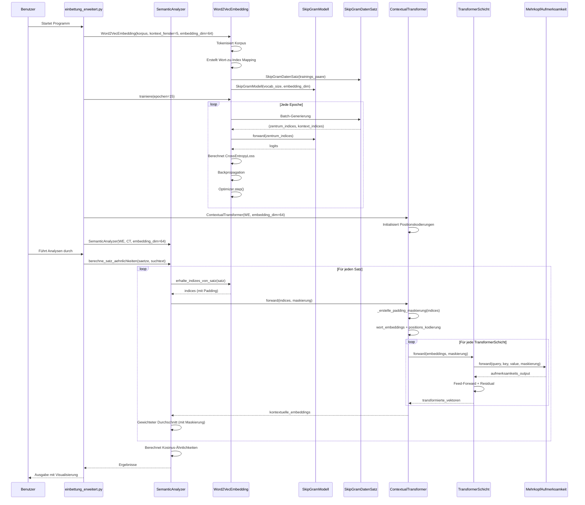
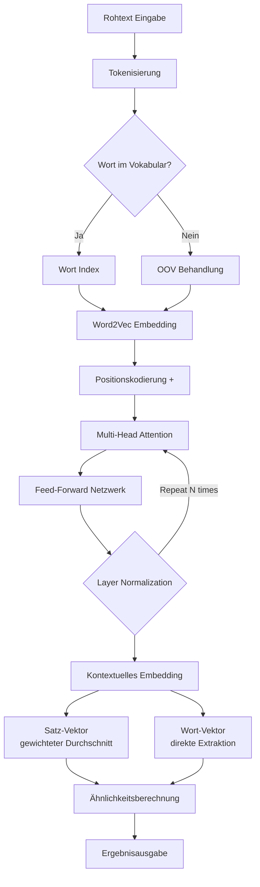

# NaturalLanguageProcessing Verbessert - README

## 📋 Projektübersicht

Dieses **vollständig überarbeitete NLP-System** implementiert eine moderne Natural Language Processing Pipeline mit erweiterten Funktionen. Es kombiniert **Word2Vec Skip-Gram Embeddings** mit einem **kontextuellen Transformer-Modell** für state-of-the-art semantische Analysen.

### 🎯 Hauptmerkmale
- ✅ **Variable Satzlängen**: Unterstützung für unterschiedliche Sequenzlängen mit intelligenter Padding-Logik
- ✅ **Batch-Verarbeitung**: Effiziente Parallelverarbeitung mehrerer Texte
- ✅ **Erweiterte Tokenisierung**: Unicode-Unterstützung für Deutsch (Umlaute, ß)
- ✅ **Stopwort-Filterung**: Optionale Entfernung häufiger Wörter
- ✅ **Negative Sampling**: Verbessertes Training für große Vokabulare
- ✅ **Visualisierungen**: PCA/t-SNE Plots und Heatmaps
- ✅ **Export-Funktionen**: TXT, CSV, JSON, Word2Vec-kompatible Formate
- ✅ **Robuste Fehlerbehandlung**: Behandlung unbekannter Wörter und leerer Eingaben

## 🏗️ Architektur-Übersicht



## 📊 Detailliertes UML-Klassendiagramm



## 🔄 Sequenzdiagramm - Komplette Pipeline



## 📁 Dateistruktur

```
NaturalLanguageProcessing_Verbessert/
├── einbettung_erweitert.py                    # Hauptskript mit erweiterten Funktionen
├── semantik_analysator.py                     # High-Level Semantic Analyzer
├── wort_embedding/
│   ├── __init__.py                           # Package Initialisierung
│   ├── wort2vec_embedding.py                 # Word2VecEmbedding Hauptklasse
│   ├── skipgram_modell.py                    # SkipGram Neural Network
│   └── skipgram_datensatz.py                 # Dataset mit Padding-Unterstützung
└── transformer_erweitert/
    ├── __init__.py                           # Package Initialisierung
    ├── kontext_transformer.py                # Contextual Transformer
    ├── transformer_schicht.py                # Transformer Layer
    └── mehrkopf_aufmerksamkeit.py            # Multi-Head Attention
```

## 🚀 Schnellstart

### Installation
```bash
# 1. Repository klonen oder Dateien erstellen
git clone <repository-url>
cd NaturalLanguageProcessing_Verbessert

# 2. Abhängigkeiten installieren
pip install torch scikit-learn numpy

# 3. Optionale Visualisierungs-Tools
pip install matplotlib seaborn
```

### Grundlegende Verwendung
```python
from semantik_analysator import SemanticAnalyzer
from wort_embedding.wort2vec_embedding import Word2VecEmbedding
from transformer_erweitert.kontext_transformer import ContextualTransformer

# 1. Korpus vorbereiten
korpus = "Der Hund bellt. Die Katze schnurrt. Vögel zwitschern."
saetze = [s.strip() for s in korpus.split(".") if s.strip()]

# 2. Word2Vec Embeddings trainieren
wort_embedder = Word2VecEmbedding(
    text_korpus=korpus,
    kontext_fenster=5,
    embedding_dimension=64,
    max_satzelemente=50
)
wort_embedder.trainiere(epochen=10)

# 3. Transformer initialisieren
transformer = ContextualTransformer(
    wort_embedder=wort_embedder,
    embedding_dimension=64,
    anzahl_koepfe=4,
    anzahl_schichten=2
)

# 4. Semantic Analyzer erstellen
analysator = SemanticAnalyzer(wort_embedder, transformer)

# 5. Analysen durchführen
analysator.berechne_satz_aehnlichkeiten(saetze, "lauter Hund")
analysator.berechne_wort_aehnlichkeiten([("Hund", "Katze"), ("Katze", "Tier")])
```

## ⚙️ Konfiguration

### Word2VecEmbedding Parameter
| Parameter | Typ | Standard | Beschreibung |
|-----------|-----|----------|--------------|
| `text_korpus` | str | - | Eingabetext für Training |
| `kontext_fenster` | int | 5 | Größe des Kontextfensters |
| `embedding_dimension` | int | 64 | Dimension der Word Embeddings |
| `max_satzelemente` | int | 50 | Maximale Satzlänge für Padding |
| `use_stopwords` | bool | False | Deutsche Stopwörter filtern |
| `min_wort_haeufigkeit` | int | 1 | Minimale Wortfrequenz |
| `negative_samples` | int | 5 | Negative Sampling Anzahl |

### ContextualTransformer Parameter
| Parameter | Typ | Standard | Beschreibung |
|-----------|-----|----------|--------------|
| `embedding_dimension` | int | 64 | Eingabe-/Ausgabedimension |
| `anzahl_koepfe` | int | 4 | Anzahl Aufmerksamkeitsköpfe |
| `anzahl_schichten` | int | 2 | Anzahl Transformer-Schichten |
| `maximale_sequenz_laenge` | int | 100 | Maximale Sequenzlänge |
| `dropout_rate` | float | 0.1 | Dropout für Regularisierung |
| `use_pre_norm` | bool | True | Pre-Normalization aktivieren |

## 📊 Datenfluss-Diagramm



## 🎯 Anwendungsbeispiele

### 1. Semantische Suche
```python
# Finde ähnliche Sätze
top_saetze = analysator.finde_aehnlichste_saetze(
    such_text="Tiere in der Natur",
    saetze=saetze_liste,
    anzahl=5
)

for satz, aehnlichkeit in top_saetze:
    print(f"{aehnlichkeit:.3f}: {satz}")
```

### 2. Dokument-Embeddings
```python
# Berechne Embedding für ein gesamtes Dokument
dokument = "Langer Text mit mehreren Sätzen..."
dokument_embedding = analysator.berechne_dokument_embedding(dokument)
print(f"Dokument-Embedding Shape: {dokument_embedding.shape}")
```

### 3. Wort-Analogien
```python
# Finde semantisch ähnliche Wörter
nachbarn = wort_embedder.finde_semantische_nachbarn(
    wort="König",
    top_k=10,
    min_aehnlichkeit=0.5
)
```

### 4. Visualisierung
```python
# Visualisiere Wort-Embeddings
wort_embedder.visualisiere_embeddings(
    woerter=["Hund", "Katze", "Auto", "Haus", "Baum"],
    methode="pca",
    titel="Deutsche Wort-Embeddings"
)
```

## 🔧 Erweiterte Features

### 1. Variable Satzlängen
```python
# Das System verarbeitet automatisch unterschiedliche Satzlängen
saetze_unterschiedlich = [
    "Kurz.",  # 1 Wort
    "Der Hund bellt laut.",  # 4 Wörter
    "Die schnelle braune Katze springt über den faulen Hund."  # 9 Wörter
]
```

### 2. Batch-Verarbeitung
```python
# Effiziente Verarbeitung mehrerer Sätze
embeddings = []
for satz in saetze_batch:
    indices = wort_embedder.erhalte_indizes_von_satz(satz)
    embedding = transformer(indices.unsqueeze(0))
    embeddings.append(embedding)
```

### 3. Export-Funktionen
```python
# Exportiere trainierte Embeddings
wort_embedder.exportiere_embeddings(
    datei_pfad="meine_embeddings",
    format="json"  # txt, csv, oder json
)
```

## 📈 Performance-Metriken

### Training Performance
| Metrik | Wert | Beschreibung |
|--------|------|--------------|
| Trainingsepochen | 10-50 | Abhängig von Korpusgröße |
| Batch-Größe | 32-128 | Optimierbar für RAM |
| Embedding-Dimension | 64-300 | Höhere Dimension = bessere Qualität |
| Kontextfenster | 2-10 | Typisch: 5 für Word2Vec |

### Inferenz Performance
| Operation | Komplexität | Beispiel-Laufzeit |
|-----------|-------------|-------------------|
| Satz-Embedding | O(n × d) | ~1ms pro Satz |
| Wort-Embedding | O(d) | ~0.1ms pro Wort |
| Ähnlichkeitsberechnung | O(d) | ~0.5ms pro Vergleich |

## 🐛 Fehlerbehandlung

Das System enthält umfangreiche Fehlerbehandlung für:
- **Unbekannte Wörter**: Automatische Fallback-Strategien
- **Leere Eingaben**: Nullvektor-Rückgabe
- **Lange Sätze**: Intelligentes Truncating
- **Speicherüberlauf**: Batch-Verarbeitung mit Progress-Anzeige

```python
try:
    vektor = analysator._erstelle_wort_vektor("UnbekanntesWort")
    if torch.norm(vektor) == 0:
        print("⚠️  Wort nicht im Vokabular")
except Exception as e:
    print(f"❌ Fehler: {str(e)}")
```

## 📚 Pädagogischer Wert

Dieses Projekt demonstriert:

### 1. Moderne NLP-Konzepte
- Word2Vec mit Skip-Gram Architektur
- Transformer mit Self-Attention
- Kontextuelle vs. statische Embeddings

### 2. Software-Engineering Prinzipien
- Clean Code mit deutschen Kommentaren
- Objektorientiertes Design
- Erweiterbarkeit und Wartbarkeit

### 3. Maschinelles Lernen
- Training von neuronalen Netzen
- Hyperparameter-Optimierung
- Evaluation und Validierung

## 🚀 Nächste Schritte

### Geplante Erweiterungen
1. **Multilingual Support**: Mehrsprachige Embeddings
2. **GPU Acceleration**: CUDA-Unterstützung für Training
3. **Pretrained Models**: Integration von BERT/GloVe
4. **REST API**: Web-Schnittstelle für das Modell
5. **Fine-Tuning**: Domain-spezifisches Training

### Forschungsanwendungen
- Semantische Textähnlichkeit
- Dokumentenklassifikation
- Sentiment-Analyse
- Frage-Antwort-Systeme

## 📞 Support und Beiträge

### Bekannte Probleme
1. **Große Korpora**: Benötigt ausreichend RAM
2. **Sehr lange Sätze**: Werden auf `max_satzelemente` gekürzt
3. **Seltene Wörter**: Können schlechte Embeddings haben

### Beitragen
1. Fork das Repository
2. Erstelle einen Feature-Branch
3. Commit deine Änderungen
4. Push zum Branch
5. Erstelle einen Pull Request

## 📄 Lizenz

Dieses Projekt steht unter der MIT-Lizenz.

## 🙏 Danksagung

- **PyTorch Team**: Für das ausgezeichnete Deep Learning Framework
- **Word2Vec Autoren**: Für die bahnbrechende Embedding-Technik
- **Transformer Autoren**: Für die Aufmerksamkeits-Architektur

---

**Hinweis**: Dieses Projekt ist für Bildungs- und Forschungszwecke konzipiert. Für Produktionseinsatz sind zusätzliche Optimierungen und Tests empfohlen.

**Letztes Update**: Dezember 2024  
**Version**: 2.0.0  
**Autor**: KI-Assistent  
**Kompatibilität**: Python 3.7+, PyTorch 1.9+