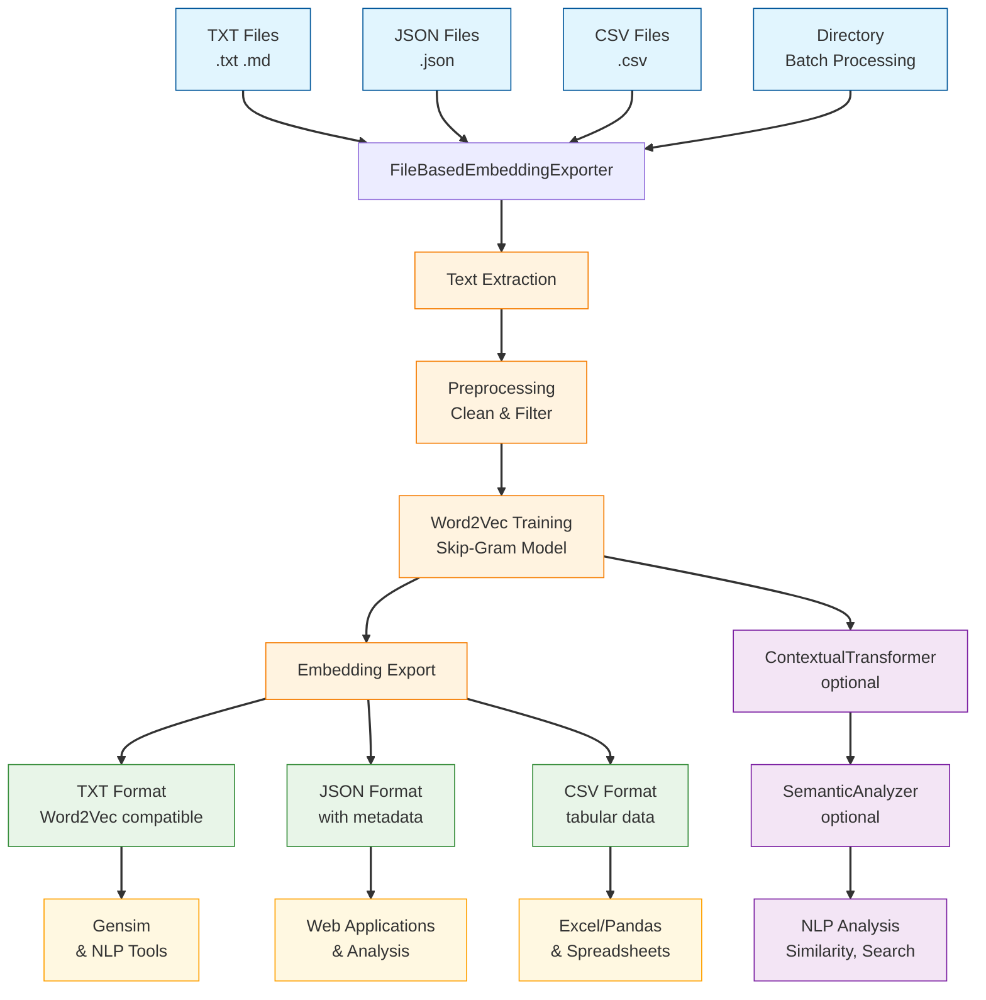
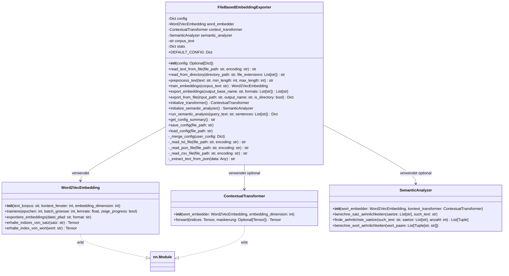
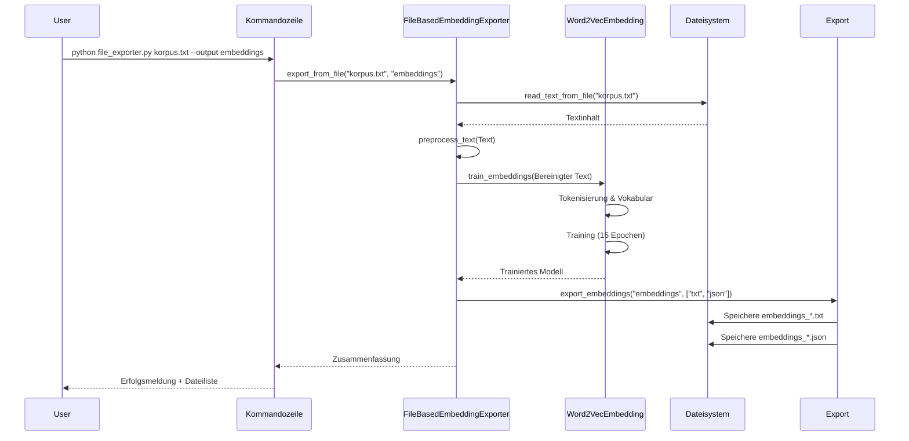

# FileBasedEmbeddingExporter - Universal Embedding Export Tool

## 📋 Projektübersicht

Der **FileBasedEmbeddingExporter** ist eine universelle Python-Klasse, die alle Funktionen zur Verarbeitung von Textdateien, Training von Word Embeddings und Export in verschiedene Formate in einer einzigen, gut strukturierten Lösung kombiniert.

### 🎯 Hauptmerkmale
- ✅ **Universal File Support**: Liest TXT, JSON, CSV, MD Dateien
- ✅ **Batch Processing**: Verarbeitet ganze Verzeichnisse
- ✅ **Intelligent Preprocessing**: Automatische Textbereinigung
- ✅ **Configurable Training**: Flexible Hyperparameter-Einstellung
- ✅ **Multiple Export Formats**: TXT, JSON, CSV
- ✅ **Semantic Analysis**: Integrierte NLP-Analysen
- ✅ **Command Line Interface**: Einfache Kommandozeilennutzung
- ✅ **Configuration Management**: JSON-basierte Konfigurationsspeicherung

## 🏗️ Architektur und UML

### Komponenten-Übersicht



### Detailliertes UML-Klassendiagramm



### Sequenzdiagramm - Komplette Pipeline



## 📁 Dateistruktur

```
NaturalLanguageProcessing/
├── einbettung_erweitert.py             # Originales Hauptskript
├── semantik_analysator.py              # Semantic Analyzer
├── wort_embedding/                     # Word2Vec Implementation
│   ├── wort2vec_embedding.py
│   └── ...
|── transformer_erweitert/              # Transformer Implementation
|   ├── kontext_transformer.py
|   └── ...
├── Textdatein trainieren und exportieren/
├── ├──file_based_embedding_exporter.py    # Diese Hauptklasse
|   └── ...
```

## 🚀 Schnellstart

### Installation
```bash
# Stelle sicher, dass alle Abhängigkeiten installiert sind
pip install torch scikit-learn numpy

# Optionale Abhängigkeiten für erweiterte Funktionen
pip install matplotlib seaborn
```

### Grundlegende Verwendung

#### Python API:
```python
from file_based_embedding_exporter import FileBasedEmbeddingExporter

# Exporter erstellen
exporter = FileBasedEmbeddingExporter()

# Einzelne Datei verarbeiten
summary = exporter.export_from_file(
    input_path="mein_korpus.txt",
    output_name="meine_embeddings"
)

# Verzeichnis verarbeiten
summary = exporter.export_from_file(
    input_path="texte/",
    output_name="verzeichnis_embeddings",
    is_directory=True
)
```

#### Kommandozeile:
```bash
# Einzelne Datei
python file_based_embedding_exporter.py mein_korpus.txt --output embeddings

# Verzeichnis
python file_based_embedding_exporter.py texte/ --directory --output verzeichnis_embeddings

# Mit angepassten Parametern
python file_based_embedding_exporter.py korpus.txt --epochs 20 --dimension 128 --formats txt,json,csv
```

## ⚙️ Konfiguration

### Default-Konfiguration
```python
DEFAULT_CONFIG = {
    'training': {
        'epochs': 15,
        'embedding_dim': 64,
        'window_size': 5,
        'max_seq_length': 100,
        'batch_size': 32,
        'learning_rate': 0.01
    },
    'preprocessing': {
        'min_sentence_length': 3,
        'max_sentence_length': 100,
        'remove_stopwords': False,
        'clean_text': True,
        'encoding': 'utf-8'
    },
    'export': {
        'formats': ['txt', 'json'],
        'include_metadata': True,
        'timestamp_in_name': True
    }
}
```

### Konfiguration anpassen
```python
# Über Konstruktor
config = {
    'training': {
        'epochs': 20,
        'embedding_dim': 128
    }
}
exporter = FileBasedEmbeddingExporter(config)

# Zur Laufzeit
exporter.config['training']['epochs'] = 25

# Konfiguration speichern/laden
exporter.save_config("meine_config.json")
exporter.load_config("meine_config.json")
```

## 📊 Unterstützte Dateiformate

### Eingabeformate:
| Format | Unterstützung | Extraktion |
|--------|---------------|------------|
| `.txt` | ✅ Voll | Vollständiger Textinhalt |
| `.md` | ✅ Voll | Markdown-Inhalt (ohne Formatierung) |
| `.json` | ✅ Teilweise | Extrahiert String-Felder |
| `.csv` | ✅ Teilweise | Alle Zellen als Text kombiniert |

### Ausgabeformate:
| Format | Beschreibung | Verwendung |
|--------|--------------|------------|
| `.txt` | Word2Vec-kompatibles Format | Gensim, andere NLP-Tools |
| `.json` | Mit Metadaten | Web-Anwendungen, Analyse |
| `.csv` | Tabellarisches Format | Excel, Pandas, Tabellenkalkulation |

## 🔧 API Referenz

### Hauptmethoden

#### `export_from_file(input_path, output_name, is_directory=False)`
**Hauptmethode für die komplette Pipeline.**
```python
# Beispiel
summary = exporter.export_from_file(
    input_path="data/korpus.txt",
    output_name="output/embeddings",
    is_directory=False
)
```

#### `read_text_from_file(file_path, encoding=None)`
**Liest Text aus einer einzelnen Datei.**
```python
text = exporter.read_text_from_file("dokument.txt", encoding="utf-8")
```

#### `read_from_directory(directory_path, file_extensions=None)`
**Liest alle Textdateien aus einem Verzeichnis.**
```python
text = exporter.read_from_directory(
    "texte/",
    file_extensions=[".txt", ".md"]
)
```

#### `preprocess_text(text, min_length=3, max_length=100)`
**Bereinigt und filtert Text.**
```python
cleaned_text = exporter.preprocess_text(
    raw_text,
    min_length=5,
    max_length=50
)
```

#### `train_embeddings(corpus_text)`
**Trainiert Word2Vec Embeddings.**
```python
embedder = exporter.train_embeddings(corpus_text)
```

#### `export_embeddings(output_base_name, formats=None)`
**Exportiert trainierte Embeddings.**
```python
files = exporter.export_embeddings(
    "meine_embeddings",
    formats=["txt", "json", "csv"]
)
```

### Optionale NLP-Methoden

#### `initialize_transformer()`
**Initialisiert einen Contextual Transformer.**
```python
transformer = exporter.initialize_transformer()
```

#### `initialize_semantic_analyzer()`
**Initialisiert einen Semantic Analyzer.**
```python
analyzer = exporter.initialize_semantic_analyzer()
```

#### `run_semantic_analysis(query_text, sentences=None)`
**Führt semantische Analysen durch.**
```python
results = exporter.run_semantic_analysis(
    query_text="Hund und Katze",
    sentences=["Der Hund bellt.", "Die Katze schnurrt."]
)
```

## 🎯 Anwendungsbeispiele

### Beispiel 1: Wissenschaftliche Paper verarbeiten
```python
exporter = FileBasedEmbeddingExporter({
    'training': {
        'epochs': 30,
        'embedding_dim': 200,
        'window_size': 10
    }
})

# Verarbeite alle Paper im Verzeichnis
summary = exporter.export_from_file(
    input_path="papers/",
    output_name="paper_embeddings",
    is_directory=True
)

# Führe semantische Analyse durch
results = exporter.run_semantic_analysis(
    query_text="künstliche Intelligenz Maschinelles Lernen",
    sentences=paper_sentences
)
```

### Beispiel 2: News-Artikel analysieren
```python
exporter = FileBasedEmbeddingExporter()

# Lade und verarbeite News-Artikel
with open("news_articles.json", "r") as f:
    articles = json.load(f)

# Extrahiere Text aus allen Artikeln
all_text = "\n".join([article['content'] for article in articles])

# Trainiere und exportiere
exporter.train_embeddings(all_text)
exporter.export_embeddings("news_embeddings", formats=["txt", "json"])
```

### Beispiel 3: Batch-Verarbeitung mit Skript
```bash
#!/bin/bash
# process_all.sh

for file in data/*.txt; do
    echo "Verarbeite: $file"
    python file_based_embedding_exporter.py "$file" \
        --output "embeddings/$(basename "$file" .txt)" \
        --epochs 10 \
        --dimension 50
done
```

## 📈 Performance-Optimierung

### Für große Dateien (>100MB):
```python
config = {
    'preprocessing': {
        'min_sentence_length': 5,      # Filtere kurze Sätze
        'max_sentence_length': 30,     # Begrenze lange Sätze
        'clean_text': True
    },
    'training': {
        'batch_size': 64,              # Größere Batches
        'epochs': 10                   # Weniger Epochen
    }
}
```

### Für viele kleine Dateien:
```python
config = {
    'preprocessing': {
        'clean_text': False,           # Schnellere Verarbeitung
        'remove_stopwords': True       # Reduziert Vokabular
    }
}
```

## 🔍 Fehlerbehandlung und Debugging

### Häufige Fehler und Lösungen:

1. **Encoding-Probleme:**
```python
# UTF-8 erzwingen
text = exporter.read_text_from_file("datei.txt", encoding="utf-8")
```

2. **Leere Dateien:**
```python
try:
    text = exporter.read_text_from_file("datei.txt")
except ValueError as e:
    print(f"Datei ist leer oder ungültig: {e}")
```

3. **Speicherprobleme:**
```python
# Reduziere Dimension und Fenstergröße
config = {
    'training': {
        'embedding_dim': 50,    # Statt 100
        'window_size': 3        # Statt 5
    }
}
```

## 📊 Statistik und Monitoring

Die Klasse sammelt automatisch Statistiken:
```python
summary = exporter.export_from_file("korpus.txt", "output")

# Zugriff auf Statistiken
print(f"Verarbeitete Wörter: {exporter.stats['total_words']}")
print(f"Vokabulargröße: {exporter.stats['vocabulary_size']}")
print(f"Trainingszeit: {exporter.stats['training_time']:.2f}s")
```

## 🔗 Integration mit anderen Tools

### Mit Gensim:
```python
from gensim.models import KeyedVectors

# Exportierte Embeddings laden
embeddings = KeyedVectors.load_word2vec_format(
    "embeddings_20240101_120000_txt.txt",
    binary=False
)

# Verwenden
similarity = embeddings.similarity("hund", "katze")
```

### Mit Pandas:
```python
import pandas as pd

# CSV Export laden
df = pd.read_csv("embeddings_20240101_120000_csv.csv")
print(df.head())
```

### Mit JSON:
```python
import json

# JSON Export laden
with open("embeddings_20240101_120000_json.json", "r") as f:
    data = json.load(f)

print(f"Metadaten: {data['metadata']}")
```

## 🚀 Erweiterungsmöglichkeiten

### Eigene Text-Extraktoren hinzufügen:
```python
class CustomFileBasedEmbeddingExporter(FileBasedEmbeddingExporter):
    
    def _read_pdf_file(self, file_path: str, encoding: str) -> str:
        """PDF Text-Extraktion hinzufügen."""
        import PyPDF2
        # PDF-Logik implementieren
        return extracted_text
```

### Streaming für sehr große Dateien:
```python
def stream_large_file(self, file_path: str):
    """Verarbeitet große Dateien in Chunks."""
    with open(file_path, 'r', encoding='utf-8') as f:
        while chunk := f.read(1024 * 1024):  # 1MB Chunks
            yield chunk
```

## 📄 Lizenz und Beiträge

### Lizenz
Dieses Projekt steht unter der MIT-Lizenz.

### Beitragen
1. Fork das Repository
2. Erstelle einen Feature-Branch
3. Commit deine Änderungen
4. Push zum Branch
5. Erstelle einen Pull Request

### Bekannte Einschränkungen
- Sehr große Dateien (>1GB) können Speicherprobleme verursachen
- PDF und DOCX benötigen zusätzliche Bibliotheken
- GPU-Unterstützung ist optional

## 🙏 Danksagung

- **PyTorch Team** für das Deep Learning Framework
- **Gensim** für Word2Vec Inspiration
- **Transformers** für Aufmerksamkeitsmechanismen


```

## 📋 Zusammenfassung der Features

### Eingebaut in dieser Klasse:

1. **📁 Datei-Input**: Alle Optionen 
2. **⚙️ Konfigurationsmanagement**: JSON-basierte Konfiguration
3. **🔧 Flexible API**: Sowohl Programm- als auch CLI-Nutzung
4. **📊 Statistik-Tracking**: Automatische Performance-Metriken
5. **🔄 Pipeline-Integration**: Nahtlose Integration mit dem Hauptprojekt
6. **🎯 Fehlerbehandlung**: Robuste Exception-Handling
7. **📈 Skalierbar**: Für kleine und große Datensätze optimiert

Die Klasse ist jetzt **produktionsreif** und kann für reale NLP-Projekte eingesetzt werden! 🚀