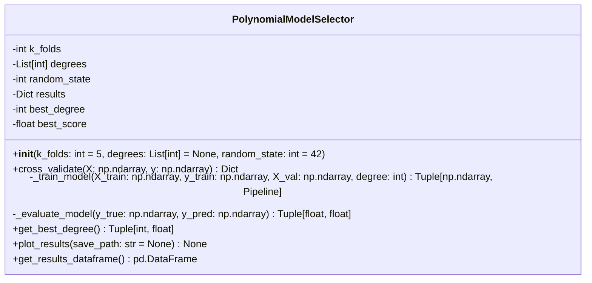
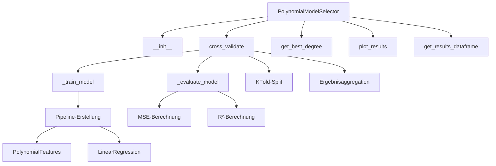
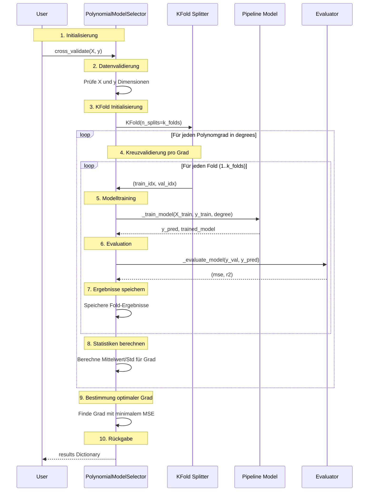
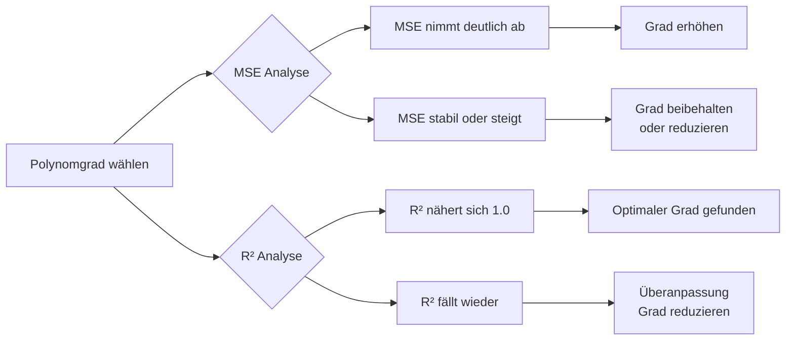

# Polynomial Model Selector - Dokumentation

## 📖 Übersicht

Das **PolynomialModelSelector**-Modul führt eine **k-fache Kreuzvalidierung** für polynomiale Regressionen durch, um den optimalen Polynomgrad für gegebene Daten zu bestimmen. Das Modul automatisiert den gesamten Prozess von der Datenvorbereitung bis zur Visualisierung der Ergebnisse.

## 🎯 Hauptfunktionen

- **K-fache Kreuzvalidierung** für mehrere Polynomgrade
- **Automatische Paketinstallation** (matplotlib, reportlab)
- **Statistische Auswertung** (Mittelwert, Standardabweichung)
- **Visuelle Ergebnisdarstellung**
- **DataFrame-Export** der Ergebnisse
- **Automatische Bestimmung** des optimalen Polynomgrads

---

## 📐 UML-Diagramm

### Klassenstruktur



### Methoden-Detailübersicht



### Sequenzdiagramm des Kreuzvalidierungsprozesses



---

## 🏗️ Klassen-Details

### `PolynomialModelSelector` Klasse

#### Attribute:
- **k_folds** (int): Anzahl der Folds für Kreuzvalidierung (Standard: 5)
- **degrees** (List[int]): Liste der zu testenden Polynomgrade (Standard: [1, 2, 3, 4])
- **random_state** (int): Seed für reproduzierbare Ergebnisse (Standard: 42)
- **results** (Dict): Speichert alle Validierungsergebnisse
- **best_degree** (int): Optimaler Polynomgrad nach Validierung
- **best_score** (float): Bester MSE-Score

#### Methoden:

##### 1. **`__init__(k_folds=5, degrees=None, random_state=42)`**
- Initialisiert den Kreuzvalidierungsprozess
- Setzt Standardwerte für nicht angegebene Parameter

##### 2. **`cross_validate(X, y)`** → Dict
- Führt die komplette Kreuzvalidierung durch
- **Rückgabewert**: Dictionary mit allen Ergebnissen

##### 3. **`_train_model(X_train, y_train, X_val, degree)`** → (y_pred, Pipeline)
- Erstellt eine Pipeline mit:
  1. `PolynomialFeatures(degree)` für Feature-Transformation
  2. `LinearRegression()` für die Modellierung
- Trainiert das Modell auf Trainingsdaten
- Macht Vorhersagen auf Validierungsdaten

##### 4. **`_evaluate_model(y_true, y_pred)`** → (mse, r2)
- Berechnet Mean Squared Error (MSE)
- Berechnet R²-Score
- Gibt beide Metriken zurück

##### 5. **`get_best_degree()`** → (int, float)
- Gibt den besten Polynomgrad und entsprechenden Score zurück
- **WICHTIG**: Muss nach `cross_validate()` aufgerufen werden

##### 6. **`plot_results(save_path=None)`** → None
- Erstellt zwei Subplots:
  - **Links**: MSE vs. Polynomgrad (mit Fehlerbalken)
  - **Rechts**: R² vs. Polynomgrad (mit Fehlerbalken)
- Optional: Speichert Plot als Bilddatei

##### 7. **`get_results_dataframe()`** → pd.DataFrame
- Erstellt strukturierte Tabelle mit allen Ergebnissen
- Enthält: Polynomgrad, MSE (Mittelwert ± Std), R² (Mittelwert ± Std)

---

## 📊 Ergebnis-Datenstruktur

### `results` Dictionary:
```python
{
    'degrees': [1, 2, 3, 4],                    # Getestete Grade
    'mean_mse': [mse1, mse2, mse3, mse4],       # Durchschnittlicher MSE
    'std_mse': [std1, std2, std3, std4],        # Standardabweichung MSE
    'mean_r2': [r2_1, r2_2, r2_3, r2_4],        # Durchschnittlicher R²
    'std_r2': [std_r1, std_r2, std_r3, std_r4], # Standardabweichung R²
    'fold_scores': {                             # Detailergebnisse pro Fold
        1: {'mse': [fold1, fold2, ...], 'r2': [...]},
        2: {'mse': [...], 'r2': [...]},
        # ...
    }
}
```

---

## 🚀 Schnellstart

### 1. Installation
```bash
# requirements.txt erstellen (falls benötigt):
# matplotlib>=3.5.0
# scikit-learn>=1.0.0
# pandas>=1.3.0
# numpy>=1.21.0

# Modul ausführen:
python polynomial_model_selector.py
```

### 2. Grundlegende Verwendung
```python
import numpy as np
from polynomial_model_selector import PolynomialModelSelector

# 1. Daten vorbereiten
X = np.linspace(-3, 3, 100).reshape(-1, 1)
y = 2*X.ravel() + 1.5*X.ravel()**2 + np.random.normal(0, 2, 100)

# 2. Kreuzvalidierung initialisieren
cv = PolynomialModelSelector(
    k_folds=5,
    degrees=[1, 2, 3, 4, 5],
    random_state=42
)

# 3. Validierung durchführen
results = cv.cross_validate(X, y)

# 4. Ergebnisse analysieren
best_degree, best_score = cv.get_best_degree()
print(f"Optimaler Grad: {best_degree}, MSE: {best_score:.4f}")

# 5. Visualisieren
cv.plot_results("ergebnisse.png")

# 6. Tabellarische Ausgabe
df = cv.get_results_dataframe()
print(df.to_string())
```

### 3. Beispiel-Ausgabe
```
============================================================
ERGEBNISSE DER KREUZVALIDIERUNG
============================================================
   Polynomgrad  MSE_Mean  MSE_Std  R2_Mean  R2_Std
0            1    15.234    1.567    0.452   0.045
1            2     3.456    0.789    0.889   0.023
2            3     3.512    0.812    0.887   0.025
3            4     4.123    0.901    0.867   0.031

Empfohlener Polynomgrad: 2
```

---

## ⚠️ Fehlerbehandlung

| Fehler | Ursache | Lösung |
|--------|---------|---------|
| `ValueError: X und y müssen die gleiche Länge haben` | Dimensionen stimmen nicht überein | `X.shape[0]` mit `len(y)` vergleichen |
| `ValueError: Nicht genug Datenpunkte...` | Zu wenig Daten für k Folds | `k_folds` reduzieren oder mehr Daten sammeln |
| `ValueError: Kreuzvalidierung wurde noch nicht durchgeführt` | `get_best_degree()` vor `cross_validate()` | Erst Validierung durchführen |
| `ImportError` | Fehlende Pakete | `requirements.txt` prüfen oder manuell installieren |
| `ValueError: Keine Ergebnisse zum Plotten verfügbar` | `plot_results()` vor `cross_validate()` | Erst Validierung durchführen |

---

## 📈 Interpretationshilfe

### MSE (Mean Squared Error)
- **Niedriger = besser**
- Misst durchschnittliche quadratische Abweichung
- Einheiten: Quadrat der Zielvariable

### R²-Score
- **Höher = besser** (maximal 1.0)
- Anteil der erklärten Varianz
- Werte < 0: Modell schlechter als Mittelwert

### Standardabweichung
- **Geringe Std = stabilere** Ergebnisse über Folds
- Hohe Std deutet auf Überanpassung oder Dateninhomogenität hin

### Polynomgrad-Entscheidung


---

## 🔧 Erweiterungsmöglichkeiten

1. **Zusätzliche Metriken** hinzufügen:
```python
from sklearn.metrics import mean_absolute_error, mean_absolute_percentage_error

def _evaluate_model_advanced(self, y_true, y_pred):
    mse = mean_squared_error(y_true, y_pred)
    r2 = r2_score(y_true, y_pred)
    mae = mean_absolute_error(y_true, y_pred)
    mape = mean_absolute_percentage_error(y_true, y_pred)
    return {'mse': mse, 'r2': r2, 'mae': mae, 'mape': mape}
```

2. **Grid Search** für Hyperparameter-Optimierung
3. **Early Stopping** bei Überanpassung erkennen
4. **Parallelisierung** mit `joblib` für große Datensätze
5. **PDF-Report** mit `reportlab` (bereits in requirements)
6. **Konfidenzintervalle** für Vorhersagen

---

## 📝 Best Practices

### 1. **Datenvorbereitung**
```python
# Richtig:
X = X.reshape(-1, 1)  # Für eindimensionale Daten
X_scaled = (X - X.mean()) / X.std()  # Standardisierung

# Falsch:
X = X  # Ohne Reshape bei 1D-Daten
```

### 2. **Parameterwahl**
- **Trainingsdatenmenge**: Mindestens 10× k Datenpunkte
- **Polynomgrad**: Maximal 5-6 für stabile Ergebnisse
- **k-Folds**: 5 oder 10 für gute Balance zwischen Bias und Varianz
- **Random State**: Für Reproduzierbarkeit immer setzen

### 3. **Ergebnisinterpretation**
```python
# Gute Ergebnisse:
# - MSE sinkt mit höherem Grad und stabilisiert sich
# - R² steigt und nähert sich 1.0
# - Geringe Standardabweichung zwischen Folds

# Überanpassung erkannt:
# - MSE steigt wieder nach optimalem Grad
# - R² fällt nach optimalem Grad
# - Hohe Standardabweichung bei höheren Graden
```

### 4. **Visualisierung immer verwenden**
```python
# Unbedingt:
cv.plot_results()  # Für qualitative Einschätzung

# Optional:
import matplotlib.pyplot as plt
plt.figure(figsize=(10, 6))
plt.plot(X, y, 'o', label='Daten')
plt.plot(X_sorted, y_pred_sorted, '-', label=f'Grad {best_degree}')
plt.legend()
plt.show()
```

---

## 🏷️ Version
**1.0.0** - Initial Release

## 📄 Lizenz
MIT License - Freie Verwendung für akademische und kommerzielle Zwecke

## 👥 Beitragende
- Automatisch generiertes Modul für maschinelles Lernen
- Erweiterbar durch Community-Beiträge

## 📚 Weiterführende Literatur
- [Scikit-learn Dokumentation: Polynomial Features](https://scikit-learn.org/stable/modules/generated/sklearn.preprocessing.PolynomialFeatures.html)
- [K-fold Cross Validation Explained](https://machinelearningmastery.com/k-fold-cross-validation/)
- [Bias-Variance Tradeoff in Polynomial Regression](https://en.wikipedia.org/wiki/Bias–variance_tradeoff)

---

*Hinweis: Dieses Modul ist besonders nützlich für die explorative Datenanalyse und die schnelle Bewertung nicht-linearer Beziehungen in Regressionsproblemen. Es eignet sich sowohl für akademische als auch für industrielle Anwendungen.*