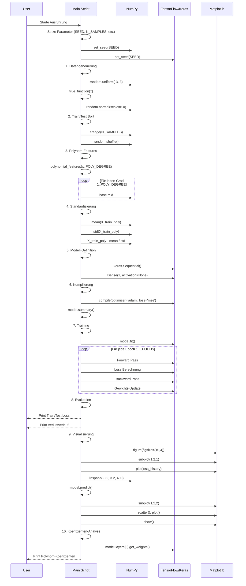
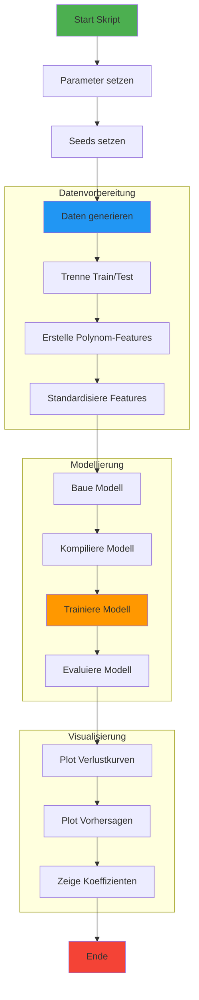
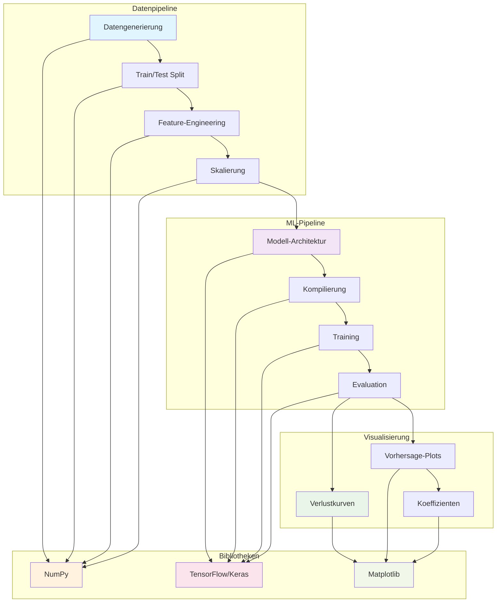
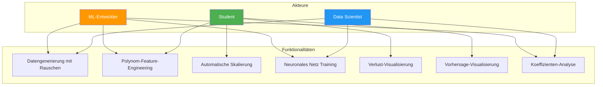
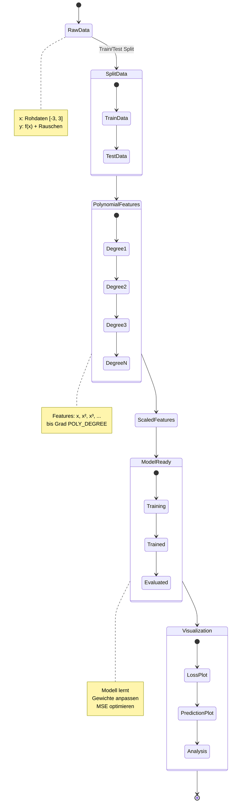
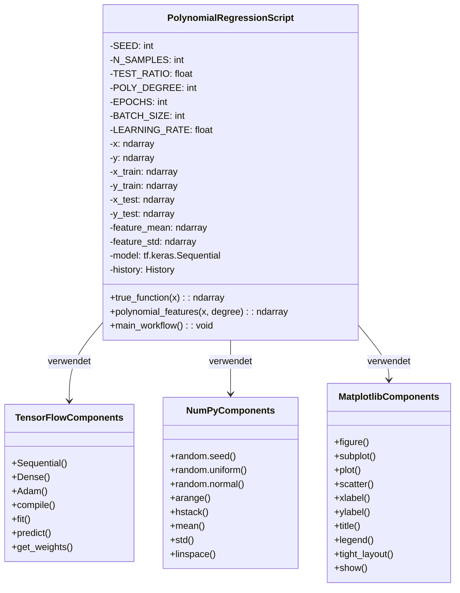

# Polynomial Regression mit TensorFlow/Keras

## 📋 Überblick

Dieses Skript implementiert eine **polynomiale Regression** mit TensorFlow/Keras für nichtlineare Daten. Es demonstriert einen vollständigen Machine-Learning-Workflow von der Datengenerierung bis zur Visualisierung.

## 🏗️ UML-Sequenzdiagramm - Gesamter Workflow



## 📊 UML-Aktivitätsdiagramm - Hauptprozess



## 🔧 UML-Komponentendiagramm - Systemarchitektur



## 🎯 UML-Use Case Diagramm



## 📊 UML-Zustandsdiagramm - Datenzustände



## 🏗️ UML-Klassendiagramm - Code-Struktur



## 🛠️ Funktionale Übersicht

### 1. **Datengenerierung**
```python
# Nichtlineare Funktion
def true_function(x):
    return 0.5 * x**3 - 1.0 * x**2 + 2.0 * x

# Mit Rauschen
y = true_function(x) + np.random.normal(scale=6.0)
```

### 2. **Feature-Engineering**
```python
def polynomial_features(x, degree):
    X_poly = []
    for d in range(1, degree+1):
        X_poly.append(x ** d)
    return np.hstack(X_poly)
```

### 3. **Modellarchitektur**
- **Input**: Polynom-Features (Grad 1..POLY_DEGREE)
- **Layer**: Dense(1) ohne Aktivierung (lineare Regression)
- **Loss**: Mean Squared Error (MSE)
- **Optimizer**: Adam

### 4. **Training & Evaluation**
```python
history = model.fit(
    X_train_scaled, y_train,
    validation_data=(X_test_scaled, y_test),
    epochs=EPOCHS,
    batch_size=BATCH_SIZE,
    verbose=0
)
```

### 5. **Visualisierung**
- Verlustkurven (Training vs. Validation)
- Vorhersage vs. echte Funktion
- Train/Test Datenpunkte

## 📈 Performance-Metriken

### Ausgabe-Beispiel:
```
Endgültiger Trainingsverlust (MSE): 25.1234
Endgültiger Testverlust (MSE):      28.5678

Beispiel: Verlustverlauf (erste 5 Epochen):
 Epoche   1 - train_loss: 120.4567 - val_loss: 115.7890
 Epoche   2 - train_loss: 89.1234 - val_loss: 92.3456
...
```

### Gelernte Koeffizienten:
```
x^1 * 1.2345
x^2 * -0.9876
x^3 * 0.4567
...
Bias (Intercept): 0.1234
```

## 🔧 Konfigurationsparameter

| Parameter | Standardwert | Beschreibung |
|-----------|--------------|--------------|
| SEED | 42 | Reproduzierbarkeit |
| N_SAMPLES | 300 | Anzahl Datenpunkte |
| TEST_RATIO | 0.2 | Test-Anteil |
| POLY_DEGREE | 5 | Polynom-Grad |
| EPOCHS | 300 | Trainingsepochen |
| BATCH_SIZE | 32 | Batch-Größe |
| LEARNING_RATE | 0.01 | Lernrate |

## 🎯 Anwendungsfälle

1. **Lernwerkzeug**: Verständnis polynomieller Regression
2. **Experimentieren**: Hyperparameter-Tuning
3. **Visualisierung**: Bias-Variance Trade-off
4. **Benchmarking**: Vergleich mit anderen Algorithmen

## 📚 Theoretische Grundlagen

### Polynomiale Regression
```
y = β₀ + β₁x + β₂x² + ... + βₙxⁿ + ε
```

### Normalisierung
```
x_scaled = (x - μ) / σ
```

### Optimierung
- **Loss Function**: Mean Squared Error
- **Optimizer**: Adam (Adaptive Moment Estimation)

## 🏆 Besonderheiten

### Komplett in NumPy/TF: Keine externen ML-Bibliotheken für Preprocessing
- **Reine NumPy-Implementierung** für alle Preprocessing-Schritte:
  - Datengenerierung (`np.random.uniform`, `np.random.normal`)
  - Train/Test Split (manuell mit `np.random.shuffle`)
  - Polynom-Feature-Engineering (eigene `polynomial_features` Funktion)
  - Standardisierung (manuelle Mittelwert- und Standardabweichungsberechnung)
- **Keine scikit-learn Abhängigkeit** für Preprocessing-Funktionen
- **Transparente Implementierung** aller Datenvorbereitungsschritte

### Reproduzierbar: Deterministische Ergebnisse durch Seeds
- **Seed-Setzung** für NumPy (`np.random.seed(42)`)
- **Seed-Setzung** für TensorFlow (`tf.random.set_seed(42)`)
- **Vorhersehbare Ergebnisse** bei wiederholter Ausführung
- **Wissenschaftliche Reproduzierbarkeit** gewährleistet

### Visuell ansprechend: Integrierte Visualisierungen
- **Komplette Plot-Suite** mit Matplotlib
- **Zweiteilige Visualisierung**:
  1. Verlustkurven über Trainingsepochen
  2. Vorhersage vs. echte Funktion
- **Direkte Ergebnisanalyse** ohne zusätzliche Tools

### Praktisch: Direkt ausführbar ohne Konfiguration
- **Einzelnes ausführbares Skript**
- **Keine externe Konfigurationsdatei** nötig
- **Parameter direkt im Code** anpassbar
- **Sofortige Visualisierung** nach Ausführung

## 🔍 Bibliotheken-Übersicht

| Bibliothek | Verwendungszweck | Alternative in anderen Projekten |
|------------|------------------|----------------------------------|
| **NumPy** | Datenmanipulation, Preprocessing | Oft scikit-learn für Preprocessing |
| **TensorFlow/Keras** | ML-Modell, Training, Evaluation | scikit-learn, PyTorch |
| **Matplotlib** | Visualisierung | Seaborn, Plotly |

**Der Kernunterschied** zu typischen ML-Projekten: Hier wird **alles Preprocessing manuell mit NumPy** implementiert, während in vielen Tutorials scikit-learn-Funktionen wie `PolynomialFeatures`, `train_test_split` und `StandardScaler` verwendet werden. Dies macht den Code **transparenter und lehrreicher**.

---

**Hinweis**: Dieses Skript demonstriert grundlegende ML-Konzepte mit TensorFlow/Keras und eignet sich ideal für Bildungszwecke und Experimente mit nichtlinearen Daten.