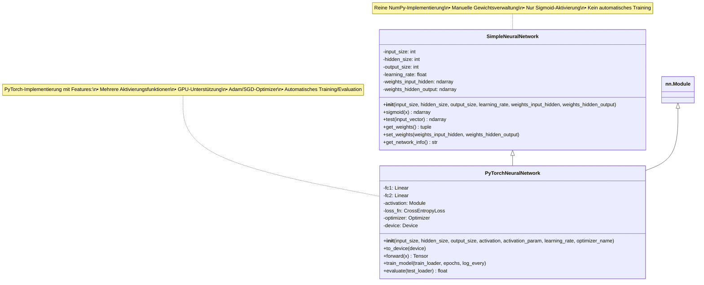
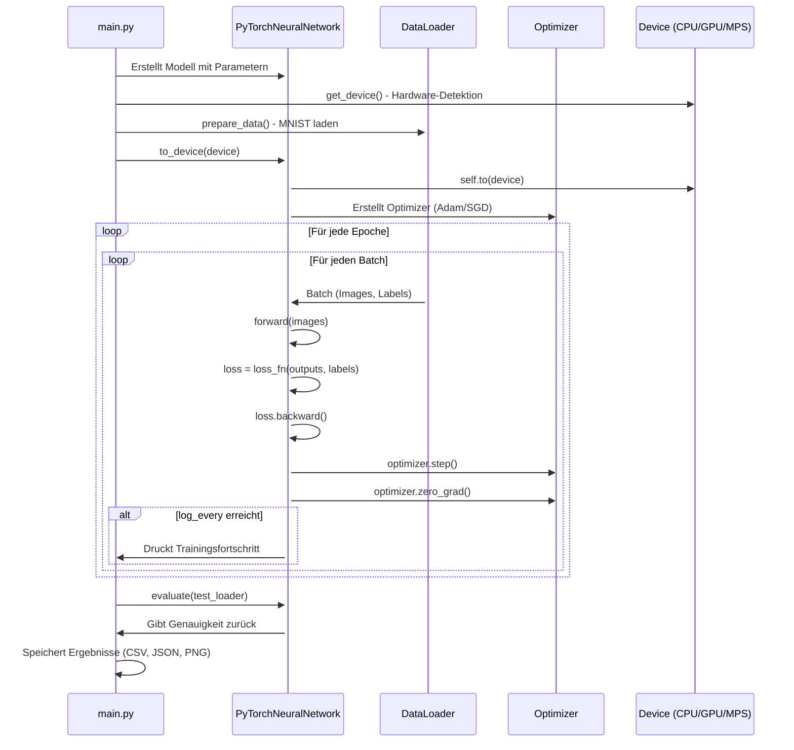
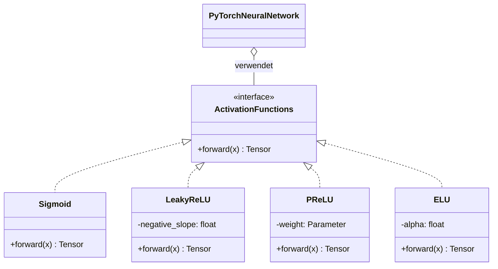
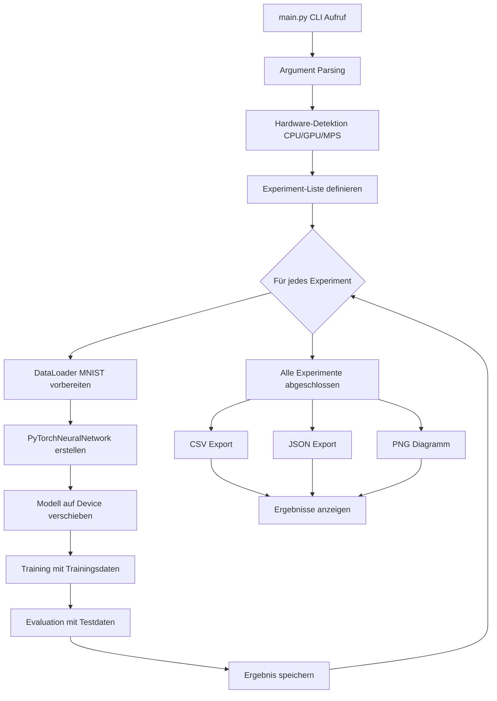

# MNIST Activation Function Experiments

## 📋 Projektübersicht

Dieses Projekt implementiert ein neuronales Netzwerk zur Klassifikation der MNIST-Handschriftendatenbank mit verschiedenen Aktivierungsfunktionen. Es enthält zwei Implementierungen:
1. **SimpleNeuralNetwork** - Eine reine NumPy-Implementierung
2. **PyTorchNeuralNetwork** - Eine PyTorch-Implementierung mit erweiterten Funktionen

## 📁 Dateistruktur

```
├── main.py                    # Hauptskript für Experimente
├── neural_network.py          # NumPy-Netzwerk (SimpleNeuralNetwork)
├── PyTorchNeuralNetwork.py    # PyTorch-Netzwerk (PyTorchNeuralNetwork)
├── requirements.txt           # Python-Abhängigkeiten
└── README.md                  # Diese Datei
```

## 🧠 UML-Diagramme

### 1. Klassendiagramm



### 2. Sequenzdiagramm - Trainingsprozess



### 3. Aktivierungsfunktionen UML



### 4. Datenflussdiagramm



## 🚀 Installation & Ausführung

### Voraussetzungen
```bash
# Python 3.8+ erforderlich
python --version

# Abhängigkeiten installieren
pip install -r requirements.txt
```

### Ausführung
```bash
# Standard-Experiment (10 Epochen, Adam Optimizer)
python main.py

# Mit angepassten Parametern
python main.py --epochs 20 --batch_size 128 --lr 0.001 --optimizer sgd

# CPU erzwingen (auch wenn GPU verfügbar)
python main.py --force_cpu

# Output-Präfix für Dateien
python main.py --out_prefix "exp1_"
```

## ⚙️ Standard-Experimente

Das Skript führt folgende Experimente automatisch durch:

| Aktivierungsfunktion | Parameter | Beschreibung |
|---------------------|-----------|--------------|
| Sigmoid             | -         | Klassische Sigmoid-Funktion |
| Leaky ReLU          | 0.01      | Kleine negative Steigung |
| Leaky ReLU          | 0.05      | Mittlere negative Steigung |
| Leaky ReLU          | 0.1       | Große negative Steigung |
| Leaky ReLU          | 0.5       | Sehr große negative Steigung |
| PReLU               | -         | Parametrisierte ReLU (lernbar) |
| ELU                 | 0.1       | Exponential Linear Unit (kleines Alpha) |
| ELU                 | 0.2       | ELU mit mittlerem Alpha |
| ELU                 | 0.3       | ELU mit großem Alpha |

## 📊 Ausgabe

Nach der Ausführung werden folgende Dateien erstellt:

1. **results.csv** - Tabellarische Ergebnisse
2. **results.json** - JSON-Formatierte Ergebnisse
3. **results.png** - Balkendiagramm der Genauigkeiten

### Beispielausgabe:
```
Activation       Param    Accuracy (%)
---------------  -------  ------------
sigmoid          -        97.23
leaky_relu       0.01     98.45
leaky_relu       0.05     98.51
leaky_relu       0.1      98.37
leaky_relu       0.5      97.89
prelu            -        98.63
elu              0.1      98.29
elu              0.2      98.34
elu              0.3      98.27
```

## 🏗️ Architekturdetails

### SimpleNeuralNetwork (neural_network.py)
- **Input Layer**: 784 Neuronen (28×28 MNIST Bilder)
- **Hidden Layer**: 100 Neuronen (konfigurierbar)
- **Output Layer**: 10 Neuronen (0-9 Ziffern)
- **Aktivierung**: Nur Sigmoid
- **Gewichtsinitialisierung**: Zufällig [-0.5, 0.5]

### PyTorchNeuralNetwork (PyTorchNeuralNetwork.py)
- **Vererbung**: Erbt von `SimpleNeuralNetwork` und `nn.Module`
- **Aktivierungsfunktionen**:
  - Sigmoid (Standard)
  - Leaky ReLU (mit parametrisierbarem Slope)
  - PReLU (parametrisiert, lernbar)
  - ELU (Exponential Linear Unit)
- **Optimizer**: Adam oder SGD mit Momentum
- **Loss Function**: CrossEntropyLoss
- **Hardware-Unterstützung**: CPU, CUDA, MPS (macOS)

## 🔧 Erweiterungsmöglichkeiten

1. **Neue Aktivierungsfunktionen hinzufügen**:
   - Swish, Mish, GELU in `PyTorchNeuralNetwork.__init__()`

2. **Hyperparameter-Tuning**:
   - Learning Rate Scheduler
   - Batch Normalization
   - Dropout Layer

3. **Weitere Datensätze**:
   - Fashion-MNIST
   - CIFAR-10 (mit Conv-Netzwerk)

4. **Visualisierung erweitern**:
   - Loss-Kurven pro Experiment
   - Confusion Matrices
   - Feature Visualisierung

## 📝 Lizenz

Dieses Projekt ist für Bildungszwecke erstellt. Die MNIST-Datenbank wird unter der Creative Commons Attribution-Share Alike 3.0 Lizenz verteilt.