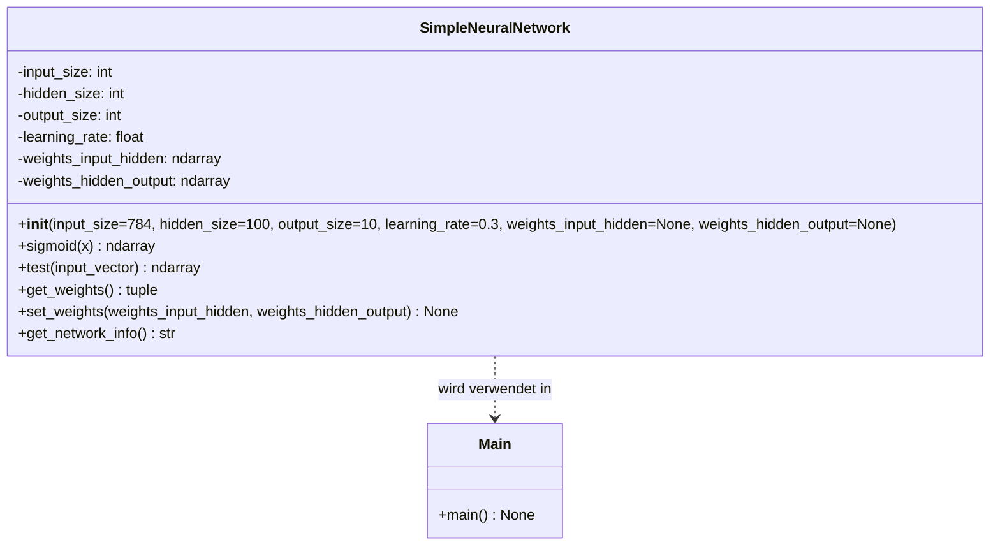
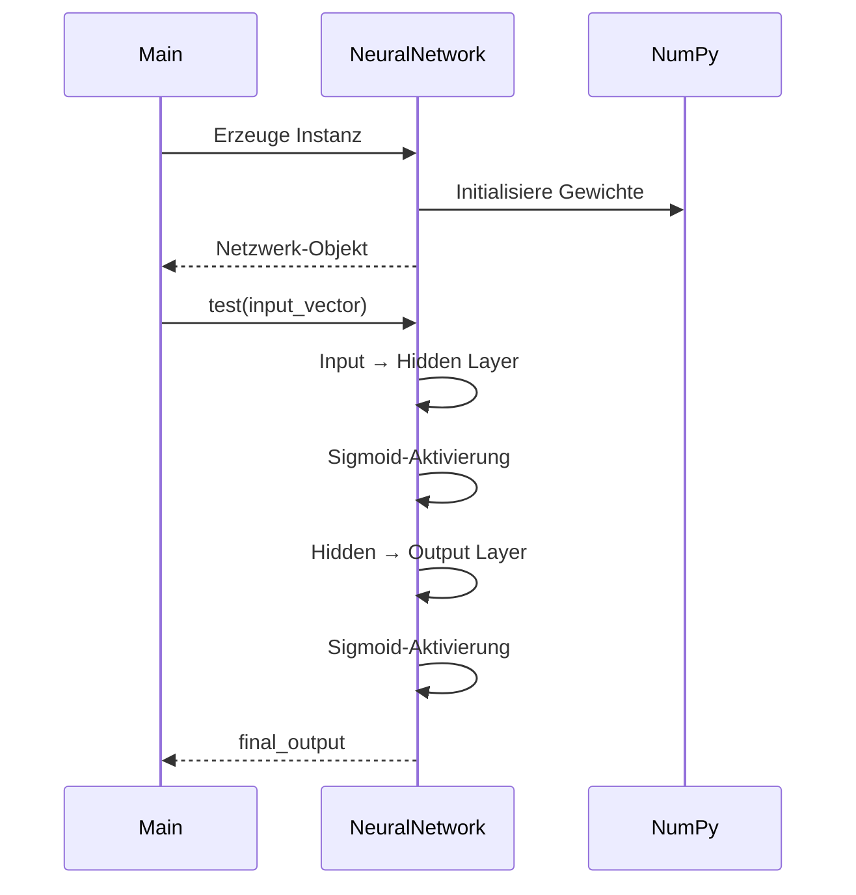
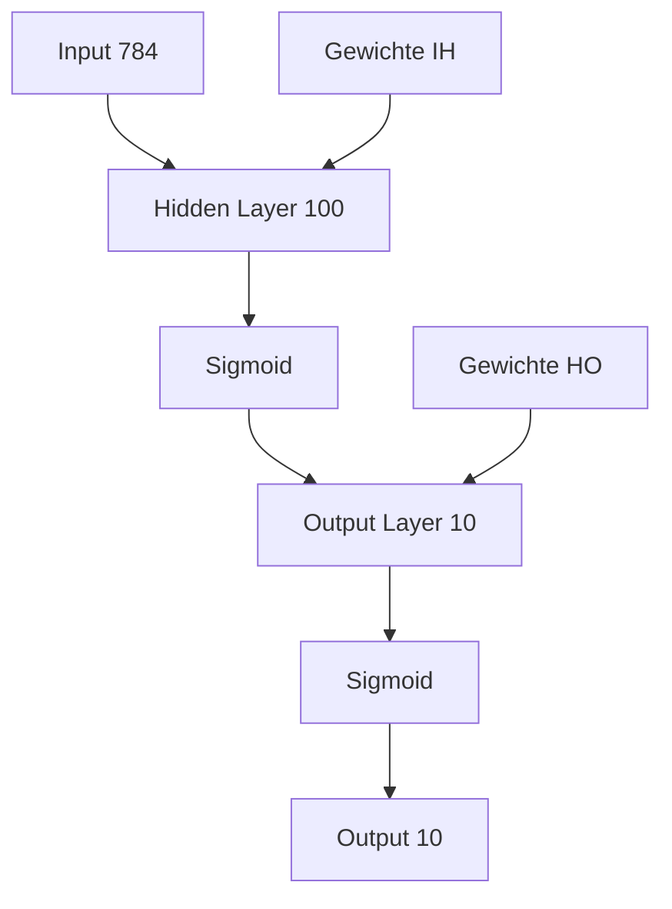

# Neural Network Projekt

## 📋 Projektübersicht

Dieses Projekt implementiert ein einfaches neuronales Netzwerk für die Klassifikation von MNIST-Daten. Das Netzwerk besteht aus drei Schichten: Input-Layer, Hidden-Layer und Output-Layer.

## 📁 Projektstruktur

```
├── neural_network.py    # Implementierung des neuronalen Netzwerks
├── main.py              # Hauptprogramm zum Testen des Netzwerks
└── README.md            # Diese Datei
```

## 🧠 Neuronales Netzwerk Architektur

### Netzwerk-Spezifikationen
- **Input Layer**: 784 Neuronen (entspricht 28x28 Pixel MNIST-Bildern)
- **Hidden Layer**: 100 Neuronen
- **Output Layer**: 10 Neuronen (entspricht den Ziffern 0-9)
- **Aktivierungsfunktion**: Sigmoid
- **Lernrate**: 0.3 (Standardwert)

### UML-Klassendiagramm



### UML-Sequenzdiagramm (Test-Prozess)



## 🛠️ Technische Implementierung

### 1. Gewichtsinitialisierung
- **Standard**: Zufällige Gewichte zwischen -0.5 und 0.5
- **Benutzerdefiniert**: Eigene Gewichtsmatrizen können übergeben werden
- **Größen**: 
  - `weights_input_hidden`: (100, 784)
  - `weights_hidden_output`: (10, 100)

### 2. Forward Pass (Test-Methode)
1. **Input → Hidden**: Matrixmultiplikation + Sigmoid
2. **Hidden → Output**: Matrixmultiplikation + Sigmoid
3. **Rückgabe**: Output-Vektor der Größe (10,)

### 3. Methodenübersicht

| Methode | Parameter | Rückgabe | Beschreibung |
|---------|-----------|----------|--------------|
| `__init__` | Größen, Gewichte, Lernrate | - | Initialisiert das Netzwerk |
| `test` | input_vector (784,) | output (10,) | Führt Forward Pass durch |
| `get_weights` | - | (weights_input_hidden, weights_hidden_output) | Gibt Gewichte zurück |
| `set_weights` | zwei Gewichtsmatrizen | None | Setzt neue Gewichte |
| `get_network_info` | - | str | Gibt Netzwerkinformationen |

## 🚀 Verwendung

### Installation
```bash
# Stelle sicher, dass NumPy installiert ist
pip install numpy
```

### Ausführung
```bash
python main.py
```

### Beispielausgabe
```
Neural Network für MNIST Klassifikation
==================================================

1. Standard Neural Network:

Neural Network Information:
- Input Layer: 784 Neuronen
- Hidden Layer: 100 Neuronen
- Output Layer: 10 Neuronen
- Learning Rate: 0.3
- Gewichtsmatrix Input-Hidden: (100, 784)
- Gewichtsmatrix Hidden-Output: (10, 100)

2. Neural Network mit benutzerdefinierten Gewichten:
...

3. Test mit simulierten MNIST-Daten:
Output Standard Network:
  Shape: (10,)
  Wertebereich: 0.4523 - 0.5217
  Vorhersage (höchster Wert): 7
```

## 📊 Datenfluss-Diagramm



## 🔧 Erweiterungsmöglichkeiten

1. **Training hinzufügen**: Backpropagation implementieren
2. **Aktivierungsfunktionen**: ReLU, Tanh etc. unterstützen
3. **Mehr Hidden-Layer**: Netzwerk tiefen erweitern
4. **Batch-Verarbeitung**: Effizientere Berechnungen
5. **Speichern/Laden**: Modellgewichte persistieren

## 📝 Hinweise

- Das Netzwerk ist aktuell nur für den Forward Pass (Test) implementiert
- Es fehlen noch Training und Backpropagation
- Die Architektur ist speziell für MNIST-Daten ausgelegt
- Sigmoid-Aktivierung kann bei tiefen Netzwerken zu Vanishing Gradients führen

## 🧪 Testen mit echten Daten

Um das Netzwerk mit echten MNIST-Daten zu testen:
```python
# Beispiel für echte MNIST-Daten
from tensorflow.keras.datasets import mnist

# Daten laden
(x_train, y_train), (x_test, y_test) = mnist.load_data()

# Daten vorbereiten (normalisieren und flatten)
x_test_flattened = x_test.reshape(-1, 784) / 255.0

# Test mit einem Beispiel
test_input = x_test_flattened[0]
prediction = nn_standard.test(test_input)
print(f"Vorhergesagte Ziffer: {np.argmax(prediction)}")
```

## 🔗 Abhängigkeiten

- Python 3.6+
- NumPy 1.19+

## 📄 Lizenz

Dieses Projekt dient Bildungszwecken und kann frei verwendet und modifiziert werden.