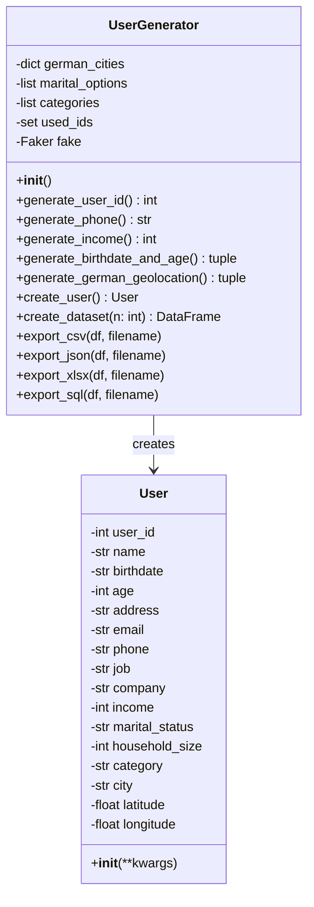
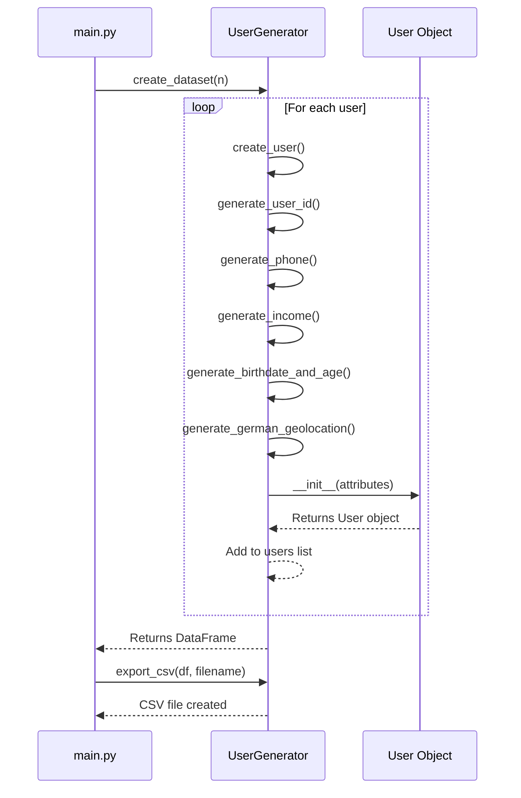

# ML-Testdatengenerator für deutsche Nutzerprofile

## 📋 Projektübersicht

Dieses Python-Projekt generiert realistische deutsche Nutzerdaten für Machine-Learning-Tests und Datenanalyse. Es erstellt synthetische Nutzerprofile mit deutschen Demografiedaten, Geodaten und sozioökonomischen Merkmalen.

## 🚀 Funktionen

- **Realistische deutsche Nutzerdaten**: Namen, Adressen, Telefonnummern nach deutschen Standards
- **Detaillierte Profile**: Beruf, Einkommen, Familienstand, Haushaltsgröße
- **Geografische Daten**: Deutsche Städte mit realen Koordinaten
- **Mehrere Exportformate**: CSV, JSON, Excel, SQL
- **ML-freundliche Struktur**: Geeignet für Klassifikations-, Regressions- und Clustering-Aufgaben
- **Erweiterte Analyse**: Feature-Analyse und ML-Anwendungsfälle

## 📁 Projektstruktur

```
ml-testdatengenerator/
├── main.py              # Hauptskript mit CLI-Interface
├── user_generator.py    # Kerngenerator-Klassen
├── requirements.txt     # Abhängigkeiten
└── README.md           # Diese Dokumentation
```

## 🛠️ Installation

1. Repository klonen oder Dateien herunterladen
2. Abhängigkeiten installieren:

```bash
pip install -r requirements.txt
```

## 📊 UML-Diagramm

### **Klassendiagramm**



### **Sequenzdiagramm - Datengenerierung**



## 🎯 Verwendung

### Basisverwendung

```bash
# Standard: 1000 Nutzer generieren
python main.py

# Bestimmte Anzahl von Nutzern
python main.py --count 5000

# Mit detaillierter Analyse
python main.py --analyze

# Verschiedene Beispiel-Datensätze
python main.py --scenarios
```

### Hauptfunktionen in `main.py`

```python
# 1. Datensatz generieren
df, generator = generate_ml_dataset(1000)

# 2. Exportieren für ML-Analyse
export_for_ml_analysis(df, generator)

# 3. Feature-Analyse durchführen
analyze_ml_features(df)

# 4. ML-Anwendungsfälle demonstrieren
demonstrate_ml_use_cases(df)
```

## 📈 Generierte Features

### Demografische Daten
- **Alter**: 18-90 Jahre, realistisch verteilt
- **Geburtsdatum**: YYYY-MM-DD Format
- **Familienstand**: Ledig, Verheiratet, Geschieden, Verwitwet
- **Haushaltsgröße**: 1-6 Personen

### Sozioökonomische Daten
- **Beruf**: Realistische deutsche Berufsbezeichnungen
- **Unternehmen**: Deutsche Firmennamen
- **Einkommen**: Monatliches Nettoeinkommen (€)
- **Kategorie**: Basic, Premium, Business, VIP

### Geografische Daten
- **Städte**: 9 deutsche Großstädte (Berlin, Hamburg, München, etc.)
- **Koordinaten**: Reale Breiten- und Längengrade
- **Adressen**: Deutsche Adressformate

### Kontaktdaten
- **Telefon**: Deutsche Telefonnummern (+49...)
- **E-Mail**: Personalisierte E-Mail-Adressen
- **Namen**: Deutsche Vor- und Nachnamen

## 💾 Exportformate

### 1. CSV (`users.csv`)
```csv
user_id,name,birthdate,age,address,email,phone,job,company,income,marital_status,household_size,category,city,latitude,longitude
```

### 2. JSON (`users.json`)
```json
[
  {
    "user_id": 12345,
    "name": "Max Mustermann",
    "birthdate": "1985-06-15",
    "age": 38,
    // ... weitere Felder
  }
]
```

### 3. Excel (`users.xlsx`)
- Enthält alle Daten in Tabellenform
- Formatierung für bessere Lesbarkeit

### 4. SQL (`users.sql`)
```sql
CREATE TABLE users (
    user_id INT PRIMARY KEY,
    name VARCHAR(100),
    birthdate DATE,
    age INT,
    -- ... weitere Spalten
);

INSERT INTO users VALUES (...);
```

## 🔍 ML-Anwendungsfälle

### 1. **Kundensegmentierung**
- Features: Einkommen, Alter, Beruf, Stadt
- Algorithmen: K-Means, DBSCAN
- Ziel: Nutzergruppen identifizieren

### 2. **Einkommensvorhersage**
- Features: Alter, Beruf, Ausbildung, Stadt
- Algorithmen: Lineare Regression, Random Forest
- Ziel: Monatliches Einkommen vorhersagen

### 3. **Churn-Prädiktion**
- Features: Nutzerkategorie, Einkommen, Alter
- Algorithmen: Logistische Regression, XGBoost
- Ziel: Abwanderungsrisiko berechnen

### 4. **Geografische Analyse**
- Features: Breitengrad, Längengrad, Stadt
- Algorithmen: Geospatial Clustering
- Ziel: Regionale Muster erkennen

## 🧪 Beispiel-Datensätze

Das Skript kann verschiedene Datensatz-Größen generieren:

1. **Kleiner Testdatensatz**: 100 Nutzer (für schnelle Tests)
2. **Mittlerer Datensatz**: 1.000 Nutzer (Standard)
3. **Großer Datensatz**: 10.000 Nutzer (für Performance-Tests)
4. **Sehr großer Datensatz**: 50.000+ Nutzer (für Big Data Tests)

## 📊 Datenanalyse-Funktionen

### Statistische Übersicht
- Deskriptive Statistiken für numerische Features
- Häufigkeitsverteilungen für kategorische Features
- Korrelationsmatrix zwischen Features

### Visualisierungen
- Altersverteilung (Histogramm)
- Einkommensverteilung (Boxplot)
- Geografische Verteilung (Scatterplot)
- Kategorienverteilung (Balkendiagramm)

### Feature-Engineering
- Altersgruppen (18-25, 26-35, 36-45, etc.)
- Einkommenskategorien (Niedrig, Mittel, Hoch)
- Entfernungen zwischen Städten
- Jahreszeiten basierend auf Geburtsdatum

## ⚙️ Konfiguration

### Städte-Koordinaten
Erweiterbar im `UserGenerator`:

```python
german_cities = {
    "Berlin": (52.5200, 13.4050),
    "Hamburg": (53.5511, 9.9937),
    # Weitere Städte hinzufügen...
}
```

### Kategorien anpassen
```python
categories = ["Basic", "Premium", "Business", "VIP", "Enterprise"]
```

### Einkommensbereiche anpassen
In `generate_income()` Methode:

```python
def generate_income(self):
    # Aktuell: 1500-8000 € Netto
    # Anpassbar für verschiedene Verteilungen
    pass
```

## 🐛 Bekannte Einschränkungen

1. **Telefonnummern**: Format +49 XXX XXXXXXX, aber keine echten Nummern
2. **E-Mail-Domains**: Standard-Faker-Domains, keine realen Unternehmen
3. **Einkommensverteilung**: Vereinfachtes Modell, keine Steuerklassen
4. **Berufe**: Begrenzte Auswahl, keine Spezialisierungen
5. **Geodaten**: Nur 9 Städte, keine ländlichen Gebiete

## 🔧 Erweiterungsmöglichkeiten

### Neue Features hinzufügen
```python
class User:
    def __init__(self, **kwargs):
        # Bestehende Features
        self.__dict__.update(kwargs)
        # Neue Features
        self.education_level = kwargs.get('education_level')
        self.vehicle_ownership = kwargs.get('vehicle_ownership')
```

### Realitätsnähe erhöhen
- Echtzeit-Daten von öffentlichen APIs
- Historische Daten für Zeitreihenanalyse
- Sozialmedia-Integration (fiktiv)
- Kaufhistorie und Verhaltensdaten

### ML-spezifische Erweiterungen
- Label für überwachtes Lernen
- Zeitstempel für sequentielle Daten
- Mehrstufige Kategorien für hierarchische Modelle
- Textdaten für NLP-Aufgaben

## 📝 Lizenz

Dieses Projekt steht unter der MIT-Lizenz. Sie können es für kommerzielle und nicht-kommerzielle Zwecke verwenden, modifizieren und verteilen.

## 🤝 Beitrag

Beiträge sind willkommen! Bitte erstellen Sie einen Pull Request oder öffnen Sie ein Issue für:
- Neue Features
- Bug-Fixes
- Dokumentationsverbesserungen
- ML-Beispiele

## 📚 Ressourcen

- [Faker Dokumentation](https://faker.readthedocs.io/)
- [Pandas Dokumentation](https://pandas.pydata.org/docs/)
- [Scikit-learn für ML-Beispiele](https://scikit-learn.org/)
- [Deutsche Demografiedaten](https://www.destatis.de/)

---

**Hinweis**: Dieses Tool erzeugt synthetische Testdaten. Die generierten Daten sind fiktiv und jede Übereinstimmung mit realen Personen ist zufällig. Nicht für produktive Systeme oder mit echten personenbezogenen Daten verwenden.